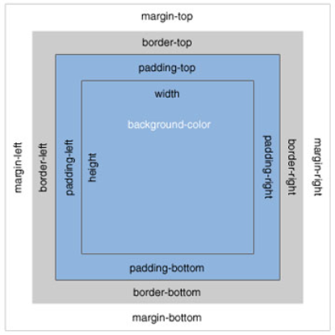
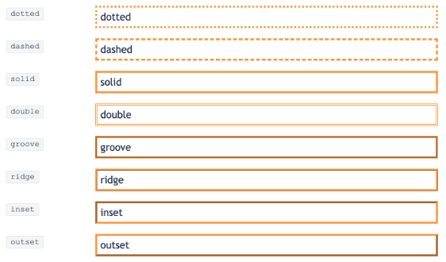
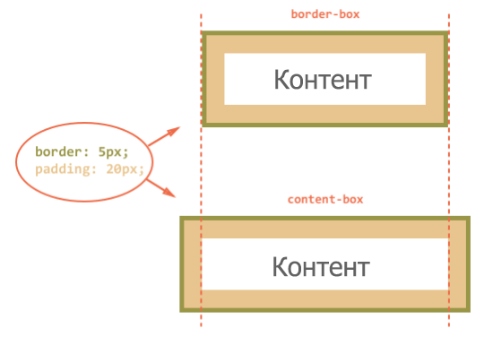

# Урок 10. Вбудовані стилі браузерів. CSS Reset. Властивості box-sizing та display.

### Мета:

* навчитися розуміти логіку роботи стилів у браузерах та впливати на них.
* розвивати навички поняття блочної моделі документа
* виховувати педантичне ставлення до написання коду та практику використання коментарів

### І. Організація навчального процесу

Перевірка готовності учнів до уроку. Відповіді на запитання учнів стосовно ДЗ. Налагодження діалогу.

### ІІ. АОЗ

1. Як можна підключити шрифт до сайту? Який спосіб краще?
2. Які CSS властивості тексту вам запам'ятались із минулого уроку?
3. Які найбільш вживані властивості шрифтів на вашу думку?

### ІІІ. Повідомлення теми та мети уроку.

Сьогодні ми продовжимо вивчати таблиці стилів та дізнаємося про популярні файли `reset.css` та `normalize.css`. Наше завдання навчитися писати код правильно, та охайно.

### IV. Мотивація

Крім того, ви дізнаєтесь, що таке поток документа і це дасть вам змогу писати втричі чистіший код.

### V. Вивчення нового матеріалу

У кожного браузера є власні вбудовані стилі для HTML документів \(сині підкреслені посилання, чорний шрифт, заголовки і т.д.\). І звичайно ж ці стилі мають деякі відмінності \(рамки полів, відступи від верхнього краю та ін\).

Щоб вони не завдавали перешкод для кросбраузерності, при написанні власних стилів, можна скинути вбудовані.

**Reset.css** - як видно із назви файлу, скидає більшість стилів браузера.

**Normalize.css** - цей файл задає стилі за замовчуванням \(замість вбудованих\) та виправляє деякі недоліки старих браузерів.

#### В чому різниця між reset.css і normalize.css

1. Normalize зберігає корисні налаштування браузера, а не стирає їх.
2. В normalize є виправлення різноманітних загальних помилок \(відображення HTML5 елементів чи форм\)
3. Файл reset.css збільшить час на написання нових стилів
4. В normalize кожне правило задокументовано, що полегшує його модифікацію

Якщо є така необхідність, то ви можете самостійно створити ці 2 файли.


Файли reset.css та normalize.css потрібно підключати раніше за власні стилі!


#### Блочна модель

Для браузера елементи сторінки являються контейнерами або блоками. Ці блоки можуть містити будь-який контент: текст, зображення, списки, таблиці та ін. Внутрішні елементи блоків самі виступають в якості блоків.



* **Область контенту** - вміст елемента, наприклад текст чи зображення
* **Внутрішній відступ \(padding\)** - відстань між контентом та гранями блоку. 


Внутрішній відступ не може бути від'ємним!


* Зовнішній відступ \(margin\) - відстань від граней блоку до сусідніх елементів. Зовнішні відступи завжди прозорі.


Значення padding та **margin** задаються в наступному порядку: **верхній, правий, нижній, лівий** \(тобто, по часовій стрілці\)


* Рамка елемента задається властивістю **border**. Якщо колір рамки не задавати, то він прийме колір основного вмісту, наприклад, тексту. по дефолту рамки відображаються поверх фону елементу, а фон розповсюджується до краю елемента. Стиль **border** задається за допомогою властивостей:
  * border-style
  * border-width
  * border-color
  * border-radius



#### `box-sizing`

Властивість box-sizing використовується для зміни блочної моделі, за допомогою якої розраховується висота та ширина елементів. Ця властивість може набувати двох значень:

* `content-box` - дефолтне значення. В такому випадку властивості width/height означають те, що знаходиться **всередині padding**.

```text
body {
    box-sizing: content-box;
}
```

* `border-box` - значення width/height задають ширину/висоту **всього елемента**

```text
body {
    box-sizing: border-box;
}
```



#### Властивість `display`

Властивість, яка визначає, як елемент має бути показаний в документі.

| display: | comment |
| :--- | :--- |
| inline | інлайн \(рядковий\) |
| block | блочний |
| inline-block: | інлайново-блочний |
| table: | таблиця |
| flex: | флекс |
| none | видаляє елемент із потоку |


### VI. Засвоєння теоретичних знань на практиці

Протягом уроку вчитель демонструє роботу скидання стилів на прикладі готових проектів. А також пропонує виконати наступні завдання:

* підключити reset.css на свою сторінку. Проаналізуйте моменти, які змінились;
* перевірте наявність властивості box-sizing: `border-box;` для елементів.

### VI. Узагальнення нового матеріалу

1. Яка різниця між файлами reset.css та normalize.css?
2. Як задаються значення відступів?
3. В яких випадках border враховується в розміри елемента?
4. Що дає нам значення `inline-block` властивості `display`?

### VII. Домашнє завдання

Створіть елемент у якого:

* ширина 350px
* висота 220px
* внутрішній відступ: зверху 15px, зліва 10px, внизу 20px, праворуч 10px
* зовнішній нижній відступ 30px
* "пунктирну" границу червоного кольору товщиною 2px
* зелений "фон" елемента

