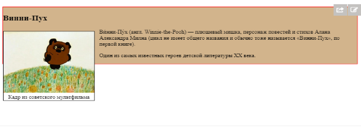

# Урок 11. Потік документа. Властивість float.

### Мета:

* навчитися розуміти логіку роботи стилів у браузерах та впливати на них.
* розвивати навички поняття блочної моделі документа
* виховувати педантичне ставлення до написання коду та практику використання коментарів

### І. Організація навчального процесу

Перевірка готовності учнів до уроку. Відповіді на запитання учнів стосовно ДЗ. Налагодження діалогу.

### ІІ. АОЗ

1. Що дає нам властивість `box-sizing: border-box;`
2. Які параметри властивості `border` ви знаєте? Пригадайте їх синтаксис.
3. Охарактеризуйте блочну модель поведінки елементів.

### ІІІ. Повідомлення теми та мети уроку.

Сьогодні ми продовжимо вивчати таблиці стилів та дізнаємося про потік документа як можна його змінити.

### IV. Мотивація

Змінюючи потік документа ви змінюєте історію проекту з ніг на голову та досягаєте дивовижних результатів у відтворені дизайну сайту.

### V. Вивчення нового матеріалу

#### Потік документа

Базовий потік - це спосіб, за яким елементи розмітки розташовуються на веб-сторінці по дефолту. вони розташовуються один за одним: блочні - зверху вниз, а рядкові - зліва направо, якщо до них не застосували CSS правила для зміни їх поведінки.

Навіть без застосування CSS правил, HTML документ вже має власні правила:

* гнучкість - як елементи адаптуються до розмірів браузера
* послідовність - порядок появи елементів

```text
<body>
  <div>1</div>
  <div>2</div>
  <div>3</div>
</body>
```


* накладання - як елементи з'являються один над одним

```text
<main>
  Цей елемент знаходиться позаду інших елементів.
  <div>
    Цей вкладений елемент належжить до уявного шару, який знаходиться поверх батьківського шару.
    <span>Цей елемент ближче до нас. Його шар розташований над шаром вже його батька.</span>
  </div>
</main>
```

#### Порушення потоку

Хоч стандартна поведінка браузера є ефективною, цього буває не достатньо для потреб дизайну. Деякі CSS властивості дозволяють порушити потік:

* `height` і `width` можуть змінити гнучкість елемента;
* `float` порушує поведінку елемента та його оточення;
* значення `absolute` і `fixed` у властивості`position` видаляють елемент із потоку \(вивчимо на наступному уроці\);
* `z-index` може змінювати порядок накладання елементів.

#### Властивість `float`

Зазвичай блочні елементи відображаються, починаючи з верхнього краю вікна браузера до нижнього краю. Властивість **float** дозволяє рухати будь-який елемент, рівняючи його по лівій стороні або по правій веб-сторінки або вмісту його контейнера. При цьому всі інші блочні елементи будуть його ігнорувати, а рядкові елементи змістяться праворуч чи ліворуч, звільнивши для нього простір і обтікаючи його.

| float: | comment |
| :--- | :--- |
| none | Значення за замовчуванням. Також відміняє будь які переміщення для елементів із групи, для яких вже було застосовано обтікання. |
| left | Елемент виривається з нормального потоку елементів та позиціонується ліворуч від краю блоку-контейнера. |
| right | Елемент позиціонується праворуч від краю блоку-контейнера. |

**Очищення потоку стилями за допомогою класу `clearfix` і псевдокласу `:after`**

```text
.clearfix:after { 
    content: ""; 
    display: table; 
    clear: both; 
}
```

Візьмемо для прикладу код:

```text
<div class="hero">
    <h2>Вінні-Пух</h2>
    <div class="left">Зображення</div>
    <p>Текст.</p>
</div>
```

та стилі для нього:

```text
.hero {
    background: #D2B48C;
    border: 1px solid red;
}

.left {
    float: left;
}
```

Через те, що блок з `float` видалений із потоку, батько не виділяє для нього місця \(дивимось на зображення знизу\).




Елемент з **float** випав за межі батьківського елемента `.hero`


**Щоб такого не відбувалось, використовують одну з наступних технік.**

* поставити батьківському елементу float. Елемент з `float` зобов'язаний розширитись, щоб помістити в собі вкладені `float-елементи`.

```text
.hero {
    background: #D2B48C;
    border: 1px solid red;
    float: left;
}
```

Звісно, не завжди можна поставити батьківському елементу `float`, тому йдемо далі.

* додати в батьківський тег елемент з властивістю clear

Додаємо елемент `div style="clear:both"` в кінець контейнера `.hero`. Він з одного боку буде нормальним елементом, в потоці, і контейнер буде зобов'язаний виділити для нього простір, з іншого боку - він знає про `float` і зміститься вниз. В результаті контейнер виросте в розмірі.

```text
<div class="hero">
    <h2>Вінні-Пух</h2>
    <div class="left">Зображення</div
    <p>Текст.</p>
    <div style="clear:both"></div>
</div>
```

Результат - правильне відображення як і в прикладі за посиланням: [https://codepen.io/mediol-git/pen/LYyGLrK](https://codepen.io/mediol-git/pen/LYyGLrK). Єдиний недолік такого способу - зайвий елемент в розмітці.

* універсальний клас clearfix

Щоб не додавати в HTML-код зайвий елемент, можна дати його через ::after

```text
.clearfix:after { 
    content: " ";      /* додати вміст: "." */
    display: table;    /* зробити блоком, бо inline не може мати clear */
    clear: both;       /* з обох боків clear */
}
```

Додавши цей класс до батьківського елемента, ми отримаємо той же результат, що й вище.

### VI. Засвоєння теоретичних знань на практиці

### VI. Узагальнення нового матеріалу

### VII. Домашнє завдання

