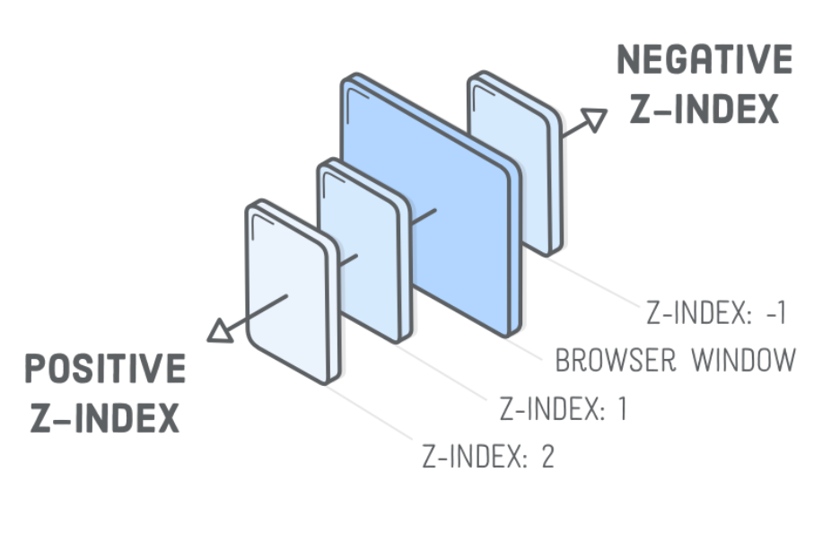
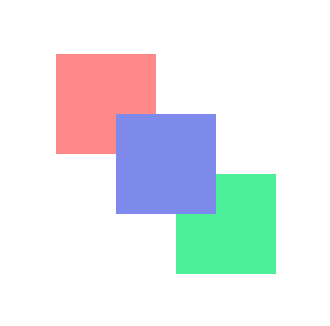
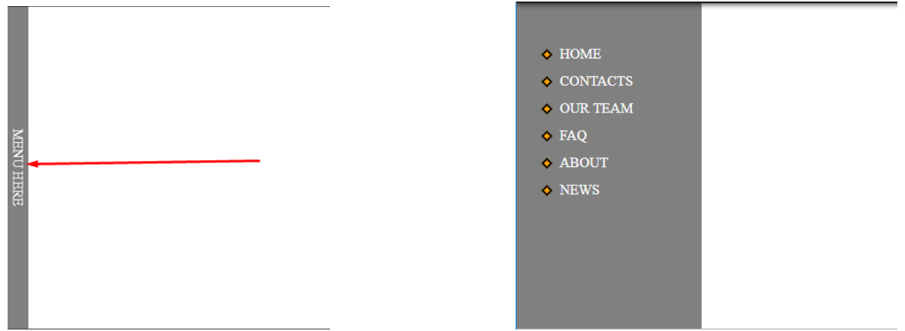
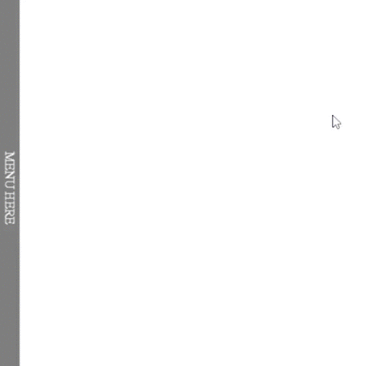

# Урок 12. Позиціонування та властивість overflow.

### Мета:

* навчитися позиціонувати елементи так, щоб досягти найбільшої точності відтворення дизайну
* розвивати навички попереднього читання дизайну та підготовки до верстки
* виховувати готовність використовувати різні способи вирішення поставлених задач

### І. Організація навчального процесу

Перевірка готовності учнів до уроку. Відповіді на запитання учнів стосовно ДЗ. Налагодження діалогу.

### ІІ. АОЗ

1. Як себе ведуть елементи в потоці?
2. Яким чином можна змусити елементи обтікати один одного?
3. Як можна порушити потік?

### ІІІ. Повідомлення теми, мети та завдань уроку

Сьогодні ми ближче познайомимося із потоком документа, та з позиціонуванням елементів на веб-сторінці. Ми навчимося виривати елемент із потоку та ставити його куди забажаємо.

### ІV. Мотивація

Ця тема дасть нам змогу робити карколомні трюки з HTML-елементами та вивести свої навики на вищий рівень - зробити квантовий стрибок у розробці.

### V. Вивчення нового матеріалу

Властивість `position` дає нам змогу точно задати нове місце положення блоку відносно того місця, де він знаходився в нормальному потоці документа. По дефолту всі елементи розташовуються послідовно один за одним в тому порядку, в якому вони записані в структурі HTML-документа.

Сама по собі властивість `position` використовується досить рідко і як правило йде в комбінації з властивостями **left, right, top, bottom**, які визначають положення елемента ліворуч, праворуч, зверху, знизу:

* `left` - задає координати від лівої сторони батьківського елемента або від вихідного положення
* `right` - те ж саме, тільки від правої сторони
* `top` - координати положення елемента від верхньої сторони батьківського елемента чи вихідного положення
* `bottom` - те ж саме, тільки знизу


Зауважте, що без використання властивості **position** не можна скористуватися властивостями **left, right, top, bottom**.


#### У `position` є п'ять значень:

* static - **дефолтне значення** - нормальне, статичне позиціювання. Елементи відображаються один за одним, за правилами потоку;

> Властивості **left, right, top, bottom** та **z-index** не працюють. [Зразок](https://codepen.io/mediol-git/pen/JjNXzzw?editors=1100)

* **`relative`** - відносне позиціювання - **елемент може зміщуватись в різних напрямках** відносно сторін батьківського елемента, а простір під ним не зникає. При цьому елемент може перекривати інший контент на сторінці;

> [Зразок](https://codepen.io/mediol-git/pen/oNWxVrR?editors=1100)

* **`absolute`** - абсолютне позиціонування - **елемент повністю видаляється з потоку документа** і позиціонується відносно найближчого блоку, який має якесь позиціонування, крім `static`або відносно елемента `body`;

> Коли елемент вирваний з потоку, всі інші елементи ведуть себе так, наче його ніколи й не було. [Зразок](https://codepen.io/mediol-git/pen/gOWrENa?editors=1100)

* **`fixed`** - **фіксує елемент у вказаному місці веб-сторінки.** Елемент завжди фіксується відносно вікна браузера і не змінює свого положення під час прокрутки сторінки. Сам елемент при цьому повністю видаляється з потоку;

> Позиціонується так само, як `absolute`, але відносно вікна браузера. [Зразок](https://codepen.io/mediol-git/pen/bGWpJbg?editors=1100)

* **`sticky`** - **'плаваючий елемент'**, який залипає коли область перегляду досягає певної позиції.

> Працюють властивості **left, right, top, bottom** та **z-index**. [Зразок](https://codepen.io/mediol-git/pen/gOWryOP?editors=1100)

**"Липучий" контейнер** - це HTML-елемент, який огортає sticky елемент. Це максимальна область, в якій може поміщатись наш елемент. Коли ми даємо елементу `position: sticky`; його батьківський елемент автоматично стає "липучим" контейнером.

#### Координати

Для руху позиціонованих елементів \(крім `static`\) можна використовувати координати **left, right, top, bottom**.

Допустимі від'ємні координати та координати, що використовують інші одиниці вимірювання. Наприклад `left: 10%` змістить елемент на 10% його ширини праворуч, а `left: -10%` - ліворуч.При цьому, частина елемента може опинитися за краєм вікна.

За відносного позиціонування елемента його переміщення відносно вихідного положення призводить до утворення пустого місця в основному потоці \(місце, що займає елемент, не заповнюється наступними за ним елементами\).

#### Властивість `z-index`

Для зміни положення елементів по осі Z застосовується властивість `z-index`, яка працює тільки для елементів ,у яких задано властивість `position` як `relative`, `absolute` або `fixed`.

Якщо в одному місці веб-сторінки опиняється декілька "абсолютних" блоків, то вони перекривають один одного. По дефолту, вище опиняється той елемент, який розташований далі по коду.

За допомогою CSS-властивості z-index можна керувати тим, як перекриваються блоки. Значенням властивості може бути ціле число \(допустимі від'ємні\). Що більше число, то вище розташовується блок.

[Зразок коду для практичного засвоєння знань](https://codepen.io/mediol-git/pen/bGWpJwR?editors=1100)

#### Властивість `oveflow`

Дана властивість керує тим, як веде себе вміст блочного елемента, якщо його розмір перевищує допустиму ширину. Зазвичай блок збільшується в розмірах, коли до нього додаються інші елементи, включаючи в себе всіх нащадків. Але що, коли висота та ширина явно вказані \(фіксовані розміри\)? В такому випадку блок не може збільшитися і контент переповнює його. Відображення такого контенту задається властивістю `overflow`.

Властивості `overflow-x/overflow-y` \(або обидва одночасно: `overflow`\) визначають поведінку контейнера при його переповненні.

| property: | comment |
| :--- | :--- |
| **visible** | За замовчуванням, контент виглядає за межі блоку. |
| **hidden** | Зайвий контент не видно. |
| **auto** | Полоса прокрутки при переповненні. |
| **scroll** | Полоса прокрутки завжди. |

Крім того, значення  `overflow: auto | hidden` змінює поведінку контейнера, в якому є `float'и`. Так як елемент з `float` знаходиться поза потоком, то зазвичай контейнер не виділяє для нього місце. Але, якщо задано таке значення overflow, то місце виділяється, тобто контейнер розтягується.

[Зразок коду для практичного засвоєння знань](https://codepen.io/mediol-git/pen/mdmPgBr?editors=1100)

### VI. Засвоєння теоретичних знань на практиці

Протягом заняття вчитель верстає з учнями фрагменти коду для практичного засвоєння знань. Фрагменти коду представлені посиланнями по ходу теоретичного матеріалу.

### VII. Узагальнення нових знань

1. В чому відмінність абсолютного позиціонування від фіксованого?
2. Як керувати "абсолютним" елементом?
3. Коли і як працюють властивості left, right, tp, bottom?
4. Як працює властивість z-index?
5. Що ви пам'ятаєте про overflow?

### VIII. Домашнє завдання

* повторіть верстку за зразком

* створіть випливаюче бокове меню при наведенні на "Menu here"

Ось так це має виглядати

