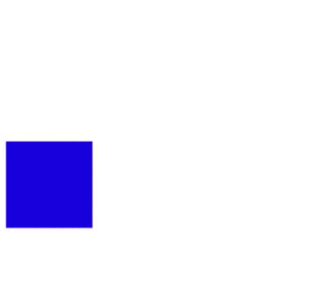

# Урок 13. Анімація в CSS. Властивості transition & transform

### Мета:

* навчити застосовувати анімаційні ефекти до розмітки сайту
* розвивати навички розрахунку анімації
* виховувати естетичні та дизайнерські смаки

### І. Організація навчального процесу

Перевірка готовності учнів до уроку. Відповіді на запитання учнів стосовно ДЗ. Налагодження діалогу.

#### ІІ. АОЗ

1. Які типи позиціонування ви пам'ятаєте?
2. Як позиціонувати абсолютний елемент відносно батьківського?
3. Коли можна застосувати властивість overflow?

### ІІІ. Повідомлення теми та мети уроку

Сьогодні ми досягнемо більшого. Ми не просто прикрасимо сайт, а додамо йому динаміки. Сьогодні ми навчимося створювати анімацію!

### IV. Вивчення нового матеріалу

`transition` дозволяє анімувати вихідне значення CSS-властивості на нове значення із плином часу, керуючи швидкістю зміни значень.

Зміна властивостей частіше всього відбувається при використанні псевдокласу `hover`. Такі переходи застосовуються до всіх елементів, включаючи `after` & `before`.

| **position:** | **comment** |
| :--- | :--- |
| **transition-property** | Містить назву властивості, до якої буде застосовано ефект переходу. Значення може містити декілька властивостей \(через кому\). |
| **transition-duration** | Задає проміжок часу, протягом якого має відбуватися перехід. Обов'язкове значення. |
| **transition-timing-function** | Властивість задає функцію часу, яка описує швидкість переходу об'єкта від одного значення до іншого. Допустимі значення: **ease , linear , ease-in , ease-out , ease-in-out , cubic-bezier.** |
| **transition-delay** | Опціональна властивість, дозволяє зробити так, щоб зміна властивостей відбувалась не моментально, а з затримкою. |

Всі властивості можна об'єднати в одну - `transition`.

`div { transition: transition-property transition-duration transition-timing-function transition-delay; }`

Наприклад:

```text
.link { 
    color: white; 
    transition: color 0.4s ease;
}
 
.link:hover { 
    color: black; 
}
```

#### Властивість `transform`

Може змінювати розмір, форму та положення елемента на веб-сторінці. Трансформації змінюють елемент, не чіпаючи інших елементів, тобто, інші не рухаються відносно трансформованих. По дефолту трансформація відбувається відносно центру елемента.

Існує 3 види трансформацій - 2D і 3D

| **position:** | **comment** |
| :--- | :--- |
| **translate\(x,y\)** | Зміщує елемент на нове місце, рухаючи його відносно звичайного положення праворуч і вниз по координатах X та Y, не чіпаючи при цьому сусідні елементи. Для руху ліворуч чи вгору використовуємо від'ємні значення. |
| **scale\(x,y\)** | Масштабує елементи, збільшуючи або зменшуючи їх. Вихідне значення дорівнює 1. Перше значення масштабує по ширині, друге - по висоті. Від'ємні значення відображають елемент дзеркально. |
| **rotate\(угол\)** | Обертає елементи на задану кількість градусів \(від 1deg до 360deg\). Негативні значення обертають елемент проти часової стрілки. |
| **skew\(x-угол, y-угол\)** | Використовується для деформації сторін елемента відносно координатних осей. Якщо вказане одне значення, друге буде визначено автоматично. |

```text
.box { 
    -webkit-transform: rotate(360deg); 
    -ms-transform: rotate(360deg);  
    transform: rotate(360deg);
}
```

Можна об'єднати декілька трансформацій одного елемента, перелічуючи їх **через пропуск** в порядку появи.

```text
.box {transform: scale(1.5) rotate(-10deg);} 
```

Допустимі значення \([Зразок тут](https://codepen.io/mediol-git/pen/abWZROb?editors=1100)\):

* `matrix()` — любое число`translate()`,
* `translateX()`, `translateY()` — единицы длины \(положительные и отрицательные\), %
* `scale()`, `scaleX()`, `scaleY()` — любое число
* `rotate()` — угол \(deg, grad, rad или turn\)
* `skew()`, `skewX()`, `skewY()` — угол \(deg, grad, rad\).

#### CSS3-анімація

Ми щойно побачили, що переходи \(`transition`\) - це просто спосіб анімації стильових властивостей від вихідного до кінцевого стану. Отже, переходи в CSS є специфічним фидом анімації, де:

* є тільки два стани, початок та кінець;
* анімація не циклічна;
* проміжні стани керуються тільки функцією часу.

Але що, коли ми хочемо:

* мати контроль над проміжними станами
* зациклити анімацію
* зробити різні види анімації для одного елемента
* анімувати певну властивість тільки до половини
* імітувти різні функції часу для різних властивостей?

Анімація в CSS дозволяє все це і не тільки!

Анімація, як міні-фільм, де ви в якості режисера даєте інструкції \(стильові правила\) вашим елементам для різних сцен \(ключові кадри\). CSS-анімація може застосовуватись практично до всіх HTML-елементів, а також для псевдоелементів `:before` і `:after`.


Під час створення анімацій варто пам'ятати про можливі проблеми із відтворенням., бо на зміну деяких властивостей потрібно багато ресурсів пристрою.


#### Властивості анімації

| property | action |
| :--- | :--- |
| `animation-name` | назва анімації |
| `animation-duration` | як довго триватиме анімація |
| `animation-timing-function` | як розраховуються проміжні стани |
| `animation-delay` | анімація починається із затримкою |
| `animation-iteration-count` | скільки разів має повторитись анімація |
| `animation-direction` | чи має анімація працювати в зворотному напрямку |
| `animation-fill-mode` | які стилі застосовуються до початку анімації та після неї |

Швидкий приклад

```text
Для оформлення кнопки завантаження, ми можемо написати анімацію "підпригування":

@keyframes bouncing{
  0%  { bottom: 0; box-shadow: 0 0 5px rgba(0,0,0,0.5); }
  100% { bottom: 50px; box-shadow: 0 50px 50px rgba(0,0,0,0.1); }
}
  
.loading-button { 
 animation: bouncing 0.5s cubic-bezier(0.1,0.25,0.1,1) 0s infinite alternate both; 
}
```

Спочатку пишемо реальну анімацію "підпригування" за допомогою `@keyframes` і називаємо її `bouncing`. Потім ви можете використовувати цю анімацію, застосовуючи її до `.loading-button`.

#### @keyframes - ключові кадри

Ключові кадри - кожен проміжний крок \(стан\) анімації. Вони визначаються а допомогою відсотків.

* 0% - перший крок анімації
* 50% - крок на пів-дорозі в анімації
* 100% - останній крок

Можна також використовувати ключові слова `from` і `to` замість `0%` і `100%` відповідно.

Кожен ключовий кадр є CSS-правилом, що означає те, що ми можемо писати CSS-властивості як зазвичай. Якщо 0% та 100% кадри не вказані, то браузер створить їх, використовуючи вихідні значення анімованої властивості.


Не рекомендується анімувати нечислові значення, так як результат може бути непередбачуваним. Також не рекомендується створювати ключові кадри для значень властивостей, які не мають середньої точки, наприклад: для значень властивості color: pink і color: \#ffffff, width: auto і width: 100px або border-radius: 0 і border-radius: 50% \(в такому випадку краще вказати border-radius: 0%;\).


#### `animation-name` <a id="animationname"></a>

Назва анімації використовується мінімум двічі:

* під час написання анімації через @keframes;
* під час використання анімації у властивості `animation-name` \(або через скорочену властивість `animation`\).

```text
@keyframes whatever {
  /* ... */
}
  
.selector {
  animation-name: whatever;
}
```


Подібно до імен CSS-класів назва анімації може включати в себе тільки:

* літери \(a-z\);
* цифри \(0-9\);
* підкреслення \(\_\);
* дефіс \(-\).
* назва не може починатись із цифри або з двох дефісів.


#### `animation-duration` <a id="animationduration"></a>

Як і тривалість переходу, тривалість анімації може бути в секундах \(1s\) або мілісекундах \(200ms\).

```text
.selector {
    animation-duration: 0.5s;
}
```

Дефолтне значення дорівнює `0s`, що значить відсутність анімації взагалі.

#### `animation-timing-function` <a id="animationtimingfunction"></a>

Часові функції для анімації можуть використовувати ключові слова, такі як `linear`, `ease-out` або можуть бути визначені за допомогою довільних кривих Безье.

```text
.selector {
    animation-timing-function: ease-in-out;
}
```

Значення за замовчуванням : ease. Оскільки анімація в CSS використовує ключові кадри, ви можете встановити лінійну функцію часу і моделювати конкретну криву Безье, визначаючи велику кількість специфічних кадрів. Спробуйте [Bounce.js](http://bouncejs.com/) для створення передової анімації.

#### `animation-delay` <a id="animationdelay"></a>

Затримка анімації може бути встановлена в секундах \(1s\) або мілісекундах \(200ms\). По дефолту - 0s, що значить - без затримки. Корисно використовувати, коли вмикається декілька анімацій в серії.

```text
.a, .b, .c { animation: bouncing 1s; }
.b { animation-delay: 0.25s; }
.c { animation-delay: 0.5s; }
```

#### `animation-iteration-count` <a id="animationiterationcount"></a>

По дефолту, анімація відтворюється тільки один раз. Ми можемо встановити три типи значень:

* цілі числа, типу 2 або 3;
* дробові числа, типу 0,5, які будуть відтворювати тільки пів анімації
* ключове слово `infinite`, яке повторюватиме анімацію постійно.

```text
.selector {
    animation-iteration-count: infinite;
}
```

#### `animation-direction` <a id="animationdirection"></a>

Властивість `animation-direction` визначає, в якому порядку читаються ключові кадри:

* `normal`: починається з 0%, закінчується на 100%, починається з 0% знову.
* `reverse`: починається зі 100%, закінчується на 0%, починається зі 100% знову.
* `alternate`: починається з 0%, йде до 100%, повертається на 0%.
* `alternate-reverse`: починається зі 100%, йде до 0%, повертається на 100%.

#### `animation-fill-mode`

Властивість `animation-fill-mode` визначає те, що відбувається до початку анімації та після її завершення.`animation-fill-mode` дозволяє повідомити браузеру, якщо стилі теж мають застосовуватись за межами анімації.

### V. Засвоєння теоретичних знань на практиці

Під час пояснення матеріалу, вчитель разом із учнями застосовує різні анімаційні ефекти до елементів, показуючи їх роботу на реальному прикладі.

### VI. Узагальнення нових знань

1. Як за допомогою властивості transform можна вирівняти абсолютний елемент по центру?
2. Властивість transition краще застосувати до елемента, чи до елемента при наведенні? В чому різниця?
3. Розкажіть алгоритм створення CSS анімації.
4. Скільки ключових кадрів можна застосовувати в анімації?
5. Як зациклити анімацію?

### VII. Домашнє завдання

Створити блок розміром 100х100. Застосувати до нього таку анімацію руху квадрата.



