# Урок 14. Flex-box. Вирівнювання та розташування flex-елементів.

### Мета:

* навчитися верстати макети, використовуючи сучасні технології
* розвивати навички прогнозування структури коду
* виховувати прагнення до написання чистого коду

### І. Організація навчального процесу

Перевірка готовності учнів до уроку. Відповіді на запитання учнів стосовно ДЗ. Налагодження діалогу.

#### ІІ. АОЗ

1. В чому різниця між CSS-анімацією та властивістю `transform`?
2. Як змінюються елементи при застосуванні властивості `transform`?
3. Які ключові кадри можна вказувати для CSS-анімації?
4. Коли варто використовувати затримку анімації?

### ІІІ. Повідомлення теми та мети уроку

Ми з вами вже досить далеко пройшли і багато чого вміємо. Але сьогодні ми навчимося думати на майбутнє та верстати сайти так, щоб на їх адаптацію довелося витрачати мінімум часу. В цьому нам допоможе технологія Flex-box.

### IV. Вивчення нового матеріалу

 **CSS flexbox \(Flexible Box Layout Module\)** - модуль макету гнучкого контейнера - являє собою спосіб компонування елементів. Flex-box складається з **flex-контейнера \(flex-container\)** - батьківського контейнера та **гнучких елементів \(flex items\)** - дочірніх блоків.

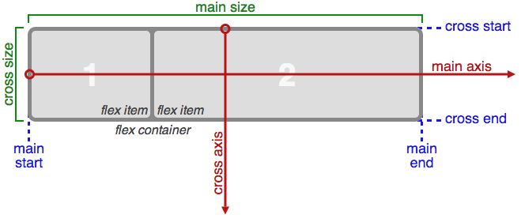

Отже, вісі flex-box - це основне поняття даної моделі.

**Головна вісь flex-контейнера \(main-axis\)** - це напрямок, в якому розташовуються його дочірні елементи. У головної осі є початок та кінець \(вони позначені на схемі\).

**Поперечна вісь flex-контейнера \(cross axis\)** - це напрям, перпендикулярний головній осі. У неї теж є початок та кінець.

Напрям головної осі починається зліва направо, а поперечної - зверху вниз.

#### Основні переваги flex-box:

* блоки легко стають гнучкими, елементи можуть стискатися та розтягуватись, заповнюючи простір;
* неважливо, в якому порядку розташовані HTML-елементи. Ми можемо змінити їх порядок через CSS;
* розташовувати елементи в одному з чотирьох напрямків: зліва направо, з права наліво, зверху вниз, знизу вгору;
* перевизначити порядок відображення елементів;
* автоматично визначати розміри елементів таким чином, щоб вони вписувались в доступний простір;
* вирішувати проблему з горизонтальним та вертикальним центруванням;
* створювати колонки однакової висоти;
* створювати "притиснутий" до низу сторінки футер.

#### Властивість display: flex;

```text
.flex-container {                    /* генерує flex-контейнер рівня блоку */
    display: -webkit-flex; 
    display: flex; 
}

.flex-container {                    /* генерує flex-контейнер рівня рядка */
    display: -webkit-inline-flex;
    display: inline-flex; 
}
```

Після встановлення даних значень властивості, дочірній елемент стає flex-елементом, шикуючись в ряд \(вздовж головної осі\) колонками однакової висоти, рівнозначній висоті flex-контейнера.

При цьому блочні та рядкові дочірні елементи ведуть себе одинаково, тобто ширина блоків дорівнює ширині їх вмісту з урахуванням полів та рамок елемента.

#### `flex-direction`

Властивість **flex-direction** визначає, яким чином flex-елементи розташовуються всередині flex-контейнера, задаючи напрям головної осі flex-контейнера. Вони можуть розташовуватись в двох основних напрямках - горизонтально, як рядки або вертикально, як колонки. Головна вісь по дефолту йде зліва направо. Поперечна - зверху вниз.

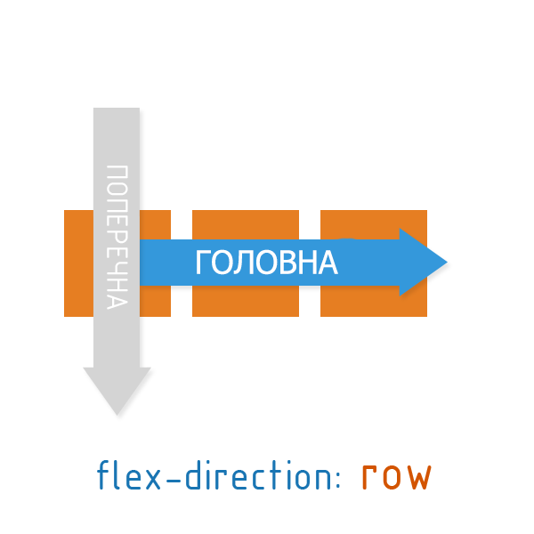

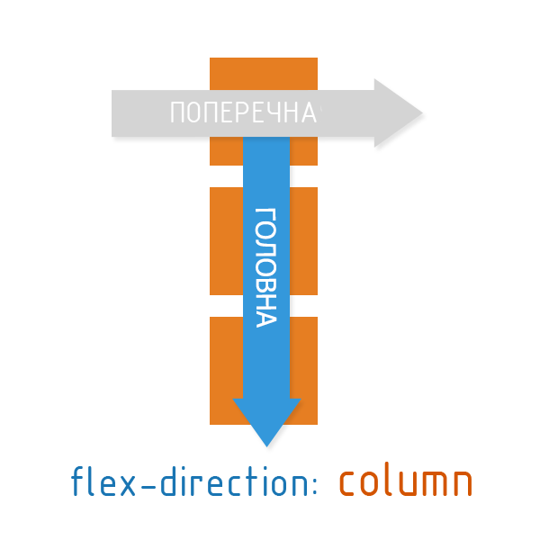

| property | comment |
| :--- | :--- |
| **row** | Дефолтне значення зліва направо. Flex-елементи розташовуються в ряд. |
| **row-reverse** | Напрямок з права наліво. Flex-елементи розташовуються в ряд відносно правого краю елемента. |
| **column** |  Направление сверху вниз. Flex-элементы выкладываются в колонку. |
| **column-reverse** | Колонка с элементами в обратном порядке, снизу вверх. |

```text
.flex-container {
    display: flex;
    flex-direction: row-reverse;
}
```

#### `flex-wrap`

Властивість **flex-wrap** управляє тим, як flex-контейнер буде розташовувати flex-елементи - в один ряд або в декілька та напрямком, в якому будуть розташовуватись нові рядки. По дефолту flex-елементи розташовуються в один ряд. При переповнення контейнера їх вміст буде виходити за межі flex-елементів. Не наслідується.

| property | image | comment |
| :--- | :--- | :--- |
| **nowrap** |  | Дефолтне значення. Flex-елементи не переносяться, а розташовуються в один ряд зліва направо. |
| **wrap** | 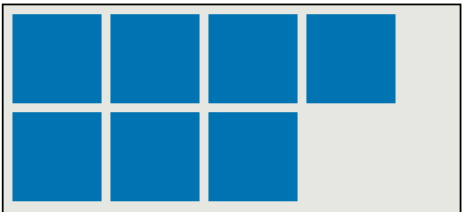 | Flex-елементи переносяться, розташовуючись в декілька горизонтальних рядків |
| **wrap-reverse** | 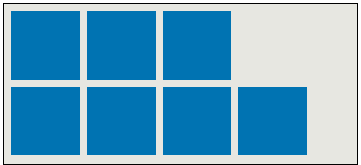 | Flex-елементи переносяться, розташовуючись у зворотному порядку зліва направо, при цьому перенесення відбувається знизу вгору |

```text
.flex-container {
    display: flex;
    flex-wrap: wrap;
}
```

#### `justify-content`

Властивість **justify-content** вирівнює flex-елементи по ширині flex-контейнера, розподіляючи вільний простір, що залишився, незайнятий flex-елементами.

| property | image | comment |
| :--- | :--- | :--- |
| **flex-start** | 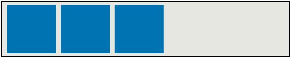 | Дефолтне значення. Flex-елементи позиціонуються від початку flex-контейнера. |
| **flex-end** | 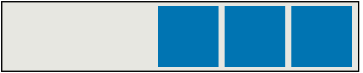 | Flex-елементи позиціонуються відносно правої межі flex-контейнера. |
| **center** | 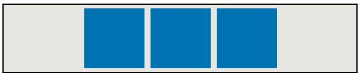 | Flex-елементи вирівнюються по центру відносно головної осі. Вільний простір розподіляється по боках рівномірно. |
| **space-around** |  | Flex-елементи рівняються по головній осі, а вільне місце ділиться порівну, додаючи відступи праворуч та ліворуч. |
| **space-between** |  | Елементи розподіляються по всьому рядку, при цьому перший елемент позиціонується на початку контейнера, а останній - в кінці контейнера. |

```text
.flex-container {
    display: flex;
    justify-content: space-between;
}
```

#### `align-items`

Властивість **align-items** вирівнює flex-елементи, в тому числі анонімні flex-елементи по перпендикулярній осі \(по висоті\).

```text
.flex-container {
    display: flex;
    align-items: flex-start;
}
```

| property | image | comment |
| :--- | :--- | :--- |
| **stretch** | 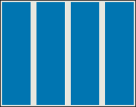 | **Значення за замовчуванням.** Flex-елементи розтягуються, займаючи весь простір по висоті. |
| **flex-start** | 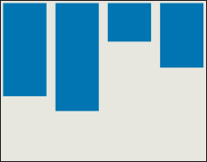 | Flex-елементи рівняються по лівому краю flex-контейнера **відносно верхнього краю блоку-контейнера**. |
| **flex-end** | 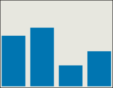 | Flex-елементи рівняються по лівому краю flex-контейнера відносно **нижнього краю блока-контейнера.** |
| **center** | 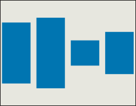 | Flex-елементи рівняються **по центру** flex-контейнера. |
| **baseline** | 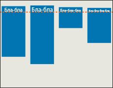 | Флекси рівняються по їх базовій лінії. |

#### `align-content`

Властивість **align-content** вирівнює лінії контейнера flex в flex-контейнері за наявності додаткового простору на перехресній осі. Ця властивість не має жодного впливу на однорядкові гнучкі блоки.

| property | image | comment |
| :--- | :--- | :--- |
| **flex-start** | 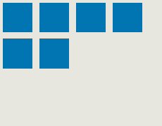 | Линии упорядочиваются начиная с cross-start. Поперечная кромка первой линии и поперечная кромка контейнера flex сбрасываются вместе. Каждая следующая строка совпадает с предыдущей. |
| **flex-end** | 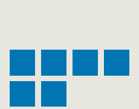 | Линии упорядочиваются начиная cross-end. Кросс-энд последней линии и кросс-энд контейнера гибкого блока сбрасываются вместе. Каждая предыдущая строка очищается следующей строкой. |
| **center** | 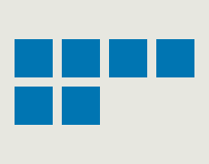 | Линии упакованы к центру контейнера Flex. Линии выравниваются по центру контейнера flex. Расстояние между кросс-стартовым краем контейнера flex и первой линией, а также между кросс-эндом контейнера flex и последней линией одинаково. |
| **space-between** | 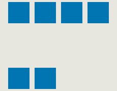 | Линии равномерно распределены в контейнере. Интервал делается так, чтобы расстояние между двумя соседними элементами было одинаковым. Поперечная кромка и поперечная кромка гибкого контейнера распределяются соответственно первой и последней кромками линии. |
| **space-around** | 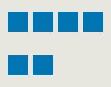 | Линии равномерно распределены таким образом, что пространство между двумя соседними линиями одинаковые. Пустое пространство перед первой и после последней строки равняется половине расстояния между двумя смежными линиями. |
| **stretch** | 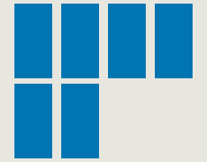 | Линии растягиваются, чтобы использовать оставшееся пространство. Свободное пространство разделено поровну между всеми линиями. |
| **space-evenly** | 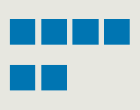 | Сначение по умолчанию. Строки равномерно распределяются таким образом, чтобы пространство между двумя соседними строками, а также пространство перед первой строкой и после последней строки было одинаковым. |

#### `order`

Властивість **order** визначає порядок, в якому flex-елементи відображаються всередині flex-контейнера. По дефолту для всіх flex-елементів заданий порядок `order: 0;` і вони йдуть один за одним як в потоці. Щоб поставити будь-який flex-елемент на початок рядка, йому треба дати `order: -1;` в кінець рядка - `order: 1`.


```text
.flex-container {
    display: flex;
}

.flex-item {
    order: 1;
}
```

#### `flex-grow`

Властивість **flex-grow** визначає те, на скільки окремий flex-блок може бути більшим від сусідніх елементів, якщо необхідно. Він визначає, яка кількість **доступного простору** всередині гнучкого контейнера має займати елемент.

Наприклад, якщо всі flex-блоки всередині контейнера мають `flex-grow: 1`, то вони будуть одинакового розміру. Якщо один з них має `flex-grow: 2`, то він буде вдвічі більшим, за всі інші.



Варто пам'ятати, що flex-grow працює тільки для головної осі \(доки ми не змінимо її напрям\).


```text
.flex-item {
	flex-grow: позитивне число;
}
```

### V. Засвоєння теоретичних знань на практиці

### VI. Узагальнення нових знань

### VII. Домашнє завдання

