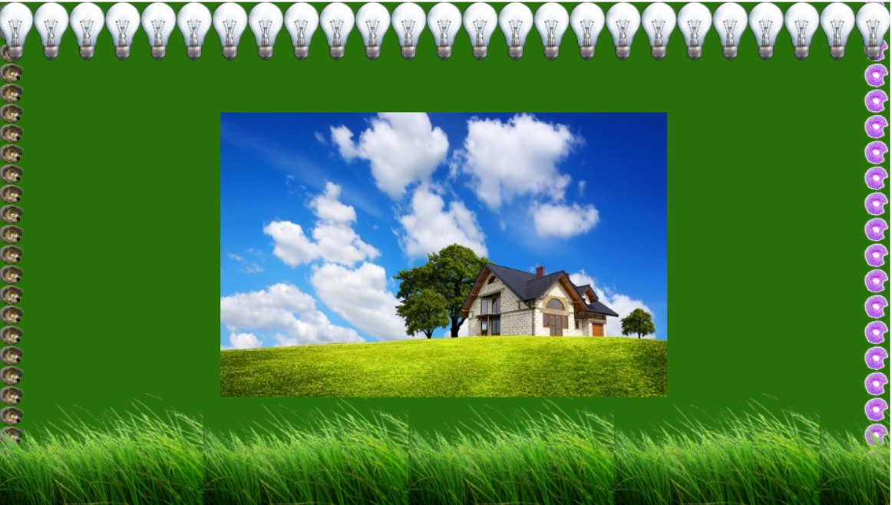

# Урок 14. Псевдоелементи. Одиниці вимірювання. Фон.

### Мета

* навчитися застосовувати псевдоелементи, обирати потрібні одиниці вимірювання
* розвивати навички використання властивості background
* виховувати вміння прогнозувати таблиці стилів для подальшої легкої адаптації сайту із мінімальною кількістю медіазапитів

### І. Організація навчального процесу

Перевірка готовності учнів до уроку. Відповіді на запитання учнів стосовно ДЗ. Налагодження діалогу.

### ІІ. АОЗ

1. Назвіть псевдокласи, котрі пам'ятаєте з минулого уроку.
2. Як можна порахувати вагу селекторів?
3. Як змусити елементи наслідувати властивості батьківського тегу?

### ІІІ. Повідомлення учням теми, мети та завдань уроку

На цьому уроці ми навчимося застосовувати різноманітні види фону для елементів, а також додавати до них ховер ефекти за допомогою псевдоелементів.

### IV. Мотивація

Навчившись застосовувати псевдоелементи, ви зможете створювати дивовижні ефекти, які різко піднімуть ваш рівень професійності.

### V. Повідомленні нового матеріалу

Якщо псевдокласи записуються із одною двокрапкою. то псевдоелементи -- із двома. Це зроблено для того, щоб розрізняти псевдокласи та псевдоелементи між собою. Розглянемо деякі псевдоелементи:

* **::after** – використовується разом із властивістю **content** та дозволяє вивести необхідні дані після вмісту елементу;
* **::before** – виконує схожу функцію, що й попередній, але виводить дані попереду вмісту елементу;
* **::selection** – цей псевдоелемент розпізнається браузерами тільки при використанні двох двокрапок та дозволяє встановити колір і фон для тексту, що виділений користувачем;
* **::first-letter** – використовується для заміни стилю першого символу в тексті елементу;
* **::first-line** – використовується для заміни стилю першого рядка в тексті елементу.

**Приклад застосування `::before`**

Припустімо, що на певний блок поверх треба накласти шар із напівпрозорим фоном. Це легко зробити, використавши псевдоелемент `::before`. Приклад виконання нижче.


#### Одиниці вимірювання в CSS

Існує багато CSS-властивостей, які потребують розмір в якості одиниць:

* **font-size** визначає розмір тексту;
* **border-width** визначає товщину кордонів елемента;
* **margin/padding** визначає відступи між елементами та всередині них;
* **left/right/top/bottom** дозволяють позиціонувати та зміщувати елементи.

**Найпопулярніші одиниці**:

* px для пікселів;
* % для відсотків;
* em для визначення розміру відносно батьківського значення font-size.

#### Пікселі `(px)`

Оскільки комп'ютерні екрани використовують пікселі для відображення контенту, це найпоширеніша одиниця вимірювання в CSS. Піксель може бути використано для встановлення фіксованої **ширини елементу**:

```text
CSS:
    body {
        width: 400px;
    }
```

Або встановити **розмір тексту**:

```text
CSS:
    body {
        font-size: 20px;
    }
```

Пікселі в CSS є простими, оскільки вони визначають абсолютні значення і не залежать від інших CSS-властивостей, що наслідуються. Вони також широко використовуються для **позиціонування** та **відступів**.

#### Відсотки `(%)`

Відсотки - це відносні одиниці: вони спираються на батьківський тег та/чи нащадок елемента. Наприклад, блочні елементи зазвичай займають всю доступну ширину. Наступне CSS-правило зменшить ширину елемента `<p>` до половини доступної ширини.

```text
CSS:
    p {
        width: 50%;
    }
```

Відсотки можуть допомогти надати інші CSS-властивості, такі як розмір тексту.

```text
HTML:
    <p>Існують <strong>важливі</strong> проблеми, що стоять перед нами.</p>

CSS:
    strong {
        font-size: 150%;
    }
```

#### `em`

em -- відносна одиниця і залежить від значення `font-size` елементу. Наприклад, якщо у батьківського тега font-size встановлений як `20px` і ви застосовуєте `font-size: 0.8em;` для дочірнього елементу, то цей дочірній елемент буде відображати `font-size` як `16px`.

Одиницю em зручно використовувати, якщо ви хочете, наприклад, щоб ваші `<h1>` були вдвічі більшими за основний текст, а елементи `<h2>` -- в 1,5 рази більші, бокова панель трохи менша. Це легко зробити в CSS.

```text
CSS:
    body {
        font-size: 16px;
    }

    h1 {
        font-size: 2em;        /* = 32px */
    }

    h2 {
        font-size: 1.5em;      /* = 24px */
    }

    aside {
        font-size: 0.75em;     /* = 12px */
    }
```

Якщо ви вирішите змінити розмір тексту `<body>`, відносні розміри заголовків та бокової панелі **зміняться відповідно** і ваша веб-сторінка залишиться **візуально збалансованою**. Змінивши тільки одне значення, зміняться всі інші значення.


Хіба не зручно?


```text
CSS:
    body {
        font-size: 20px;
    }
    
    h1 {
        font-size: 2em;        /* = 40px */
    }
    
    h2 {
        font-size: 1.5em;      /* = 30px */
    }
    
    aside {
        font-size: 0.75em;     /* = 15px */
    }
```

#### `rem`

Одиниця **rem** схожа на em, але замість залежності від батьківського значення, вона **спирається на значення основного елементу**, яким являється елемент `<html>`.

```text
CSS:
    html {
        font-size: 18px;
    }
    
    body {
        font-size: 1rem;     /* = 18px */
    }
    
    h1 {
        font-size: 2rem;     /* = 36px */
    }
    
    h2 {
        font-size: 1.5rem;   /* = 27px */
    }
```

Різниця між `rem` і `em` в тому, що значення rem фіксоване, в той час як значення em перемножується одне з одним.

```text
Якщо ви встановили 
html {
    font-size: 18px;
}:

*   2rem завжди буде дорівнювати 36px, незалежно від того,
    де воно використовується у вашому CSS;
*   2em завжди буде дорівнювати подвоєному font-size батьківського тега,
    що не обов'язково дорівнює 36px.
```

Швидкий приклад, де `2em` відрізняється від `2rem`:

```text
HTML:
    <p>Існують <strong>важливі</strong> проблеми, <span>що стоять</span> перед нами.</p>

CSS:
    html {
        font-size: 20px;
    }
    
    p {
        font-size: 0.8rem;        /* = 16px */
    }
    p span {
        font-size: 2em;           /* = 16px * 2 = 32px */
    }
    p strong {
        font-size: 2rem;          /* = 20px * 2 = 40px */
    }
```

`<span>` спирається на значення font-size у `<р>`, в той час як `<strong>` спирається на значення font-size у `<html>`. Якщо розмір в em/rem змінити, давши йому більше одиниці, то шрифт збільшиться. Якщо його задати менше одиниці, то шрифт зменшиться. Тобто, цифра поряд з одиницею em є множителем для розміру шрифта.

> #### Які одиниці використовувати?
>
> Все-таки краще почати з пікселів, так як це абсолютна величина і початківцю буде легше прорахувати розміри та співвідношення елементів розмітки.
>
> Відсотки та одиниці em можуть бути використані поряд із пікселями, особливо для відносних розмірів тесту.

#### Властивості фону - background

Фон на веб-сайті дуже важливий елемент оформлення. Для нього передбачено багато властивостей та їх варіацій. Всі вони починаються зі слова `background` \(від англ. - фон\).

* **`background-color`** -- встановлює фоновий колір для будь-якого елемента
* **`background-image`** -- в якості фону для елементу встановлює зображення
* **`background-repeat`** -- якщо фонове зображення менше за розміром від елемента, то зображення буде повторюватись по горизонталі та вертикалі, прагнучи заповнити весь елемент.
  * `repeat` -- \(значення за замовчуванням\) фонове зображення повторюється по осям **х** та **y**
  * `repeat-x` -- зображення повторюється по осі **х**
  * `repeat-y` -- зображення повторюється по осі **у**
  * `no-repeat` -- фонове зображення не повторюється
* **`background-position`** -- позиціонування зображення відносно елемента. Можна задавати в пікселях, відсотках та словесними значеннями типу `left`, `right`, `top`, `bottom`.
* **`background-size`** -- розмір фонового зображення. Можна задавати в пікселях та відсотках. А також існує три глобальних значення для визначення розміру фонового зображення:
  * `auto` -- зображення приймає власний розмір
  * `cover` -- зображення повністю заповнює елемент, зберігаючи пропорції
  * `contain` -- зображення вміщується в розміри елемента
* **`background-attachment`** -- визначає, чи буде фонове зображення прокручуватись разом із веб-сторінкою, чи ні:
  * `fixed` -- фон зафіксований \(використовується для parallax-ефекту\)
  * `scroll` -- зображення прокручується разом із сторінкою \(за замовчуванням\)
  * `local` -- зображення скролиться разом із вмістом елементу, а далі не йде, якщо елемент закінчився
* **`background-clip`** -- визначає, як фонове зображення або колір будуть виводитись відносно граней елемента:
  *  `content-box` -- фон відображається тільки під вмістом елементу
  * `border-box` -- виводиться під контентом та гранями
  * `padding-box` -- відображається всередині граней
* **`background-origin`** -- те саме, що й background-clip з такими ж значеннями, тільки задає положення відносно граней не поточного елементу, а батьківського.

Більшість параметрів для фону можна об'єднати в одну властивість. Наприклад, у властивість background можна одночасно записати колір фону, декілька зображень для фону, їх розмір, позиціонування, повторення.

```text
HTML:
    <div class="box"></div>

CSS:
    .box {
        background: url(посилання на зображення) center / cover no-repeat;
    }
```

### VI. Застосування нових знань на практиці

Протягом пояснення фонових властивостей вчитель разом із учнями верстає для прикладу наступного плану [код](https://codepen.io/mediol-git/pen/zYZmKVm).

### VII. Узагальнення нових знань

1. Яка обов'язкова властивість для псевдокласів `before` та `after`?
2. Як до елемента додати напівпрозорий шар?
3. В чому різниця між одиницями `em` та `rem`?
4. Які властивості фону ви запам'ятали?
5. Як можна використати властивість background-attachment?

### VIII. Домашнє завдання

 У вас є html код, який не можна змінювати! Використовуйте тільки стилі!

```text
<div class="bg-box"></div>
```

**Завдання:** За допомогою властивості background створити блок, як на зображенні нижче.



Посилання на картинки для фону:

* [https://img2.goodfon.ru/wallpaper/big/0/5b/pole-zelen-trava-dom-derevya.jpg](https://img2.goodfon.ru/wallpaper/big/0/5b/pole-zelen-trava-dom-derevya.jpg)
* [https://www.freeiconspng.com/uploads/grass-png-images-pictures-transparent-28.png](https://www.freeiconspng.com/uploads/grass-png-images-pictures-transparent-28.png)
* [https://www.freeiconspng.com/uploads/lamp-png-0.png](https://www.freeiconspng.com/uploads/lamp-png-0.png)
* [https://vignette.wikia.nocookie.net/mashaandthebear/images/e/e0/Ёжик.png/revision/latest?cb=20180209130328&path-prefix=ru](https://vignette.wikia.nocookie.net/mashaandthebear/images/e/e0/%D0%81%D0%B6%D0%B8%D0%BA.png/revision/latest?cb=20180209130328&path-prefix=ru)
* [https://avatanplus.com/files/resources/mid/58eb07b830eab15b56162788.png](https://avatanplus.com/files/resources/mid/58eb07b830eab15b56162788.png)

