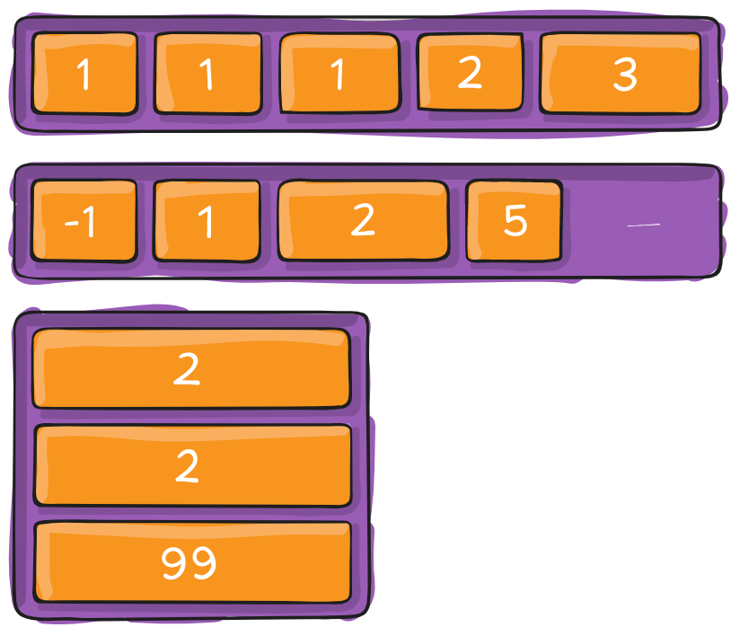
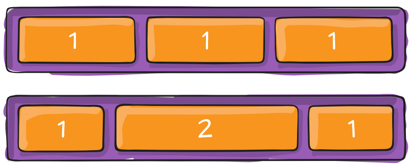

# Урок 15. Flex-box. Порядок та розміри flex-елементів.

### Мета:

* навчитися визначати та застосовувати правильний порядок елементів відносно flex-контейнера
* розвивати навички роботи з розмірами flex-елементів
* виховувати вміння скорочувати CSS-код та не повторюватись.

### І. Організація навчального процесу

Перевірка готовності учнів до уроку. Відповіді на запитання учнів стосовно ДЗ. Налагодження діалогу.

#### ІІ. АОЗ

1. В чому різниця між CSS-анімацією та властивістю `transform`?
2. Як змінюються елементи при застосуванні властивості `transform`?
3. Які ключові кадри можна вказувати для CSS-анімації?
4. Коли варто використовувати затримку анімації?

### ІІІ. Повідомлення теми та мети уроку

Ми з вами вже досить далеко пройшли і багато чого вміємо. Але сьогодні ми навчимося думати на майбутнє та верстати сайти так, щоб на їх адаптацію довелося витрачати мінімум часу. В цьому нам допоможе технологія Flex-box.

### IV. Вивчення нового матеріалу

#### `order`

Властивість **order** визначає порядок, в якому flex-елементи відображаються всередині flex-контейнера. По дефолту для всіх flex-елементів заданий порядок `order: 0;` і вони йдуть один за одним як в потоці. Щоб поставити будь-який flex-елемент на початок рядка, йому треба дати `order: -1;` в кінець рядка - `order: 1`.



```text
.flex-container {
    display: flex;
}

.flex-item {
    order: 1;
}
```

#### `flex-grow`

Властивість **flex-grow** визначає те, на скільки окремий flex-блок може бути більшим від сусідніх елементів, якщо необхідно. Він визначає, яка кількість **доступного простору** всередині гнучкого контейнера має займати елемент.

Наприклад, якщо всі flex-блоки всередині контейнера мають `flex-grow: 1`, то вони будуть одинакового розміру. Якщо один з них має `flex-grow: 2`, то він буде вдвічі більшим, за всі інші.




Варто пам'ятати, що flex-grow працює тільки для головної осі \(доки ми не змінимо її напрям\).


```text
.flex-item {
	flex-grow: позитивне число;
}
```

#### flex-shrink

Це пряма протилежність `flex-grow`. Властивість визначає, наскільки блоку можна зменшитись в розмірі. `flex-shrink` використовується, коли елементи не поміщаються в контейнері. Ми визначаємо, які елементи мають зменшитись в розмірах, а які - ні.

По дефолту `flex-shrink: 1;`. Це означає, що блоки будуть стискатись, коли контейнер буде зменшуватись. Варто пам'ятати, що `flex-shrink` базується на пропорціях. Тобто, якщо у блока `flex-shrink: 6`, а в інших він дорівнює 2, то це значить, що наш блок буде стискатися втричі швидше за інші.

```text
Застосовуються цілі (1, 2, 3,…) або дробові числа (наприклад: 0.6). Від'ємні значення ігноруються.

.flex-item {
     flex-shrink: <число>;
}
```

Разом із властивістю `flex-shrink` потрібно використовувати `flex-basis`, який задає базовий розмір елемента. Якщо ми його не вкажемо, то працювати наша властивість `flex-shrink` не буде.

### V. Засвоєння теоретичних знань на практиці

Пропоную продовжити верстку макету з минулого уроку



### VI. Узагальнення нових знань

### VII. Домашнє завдання

