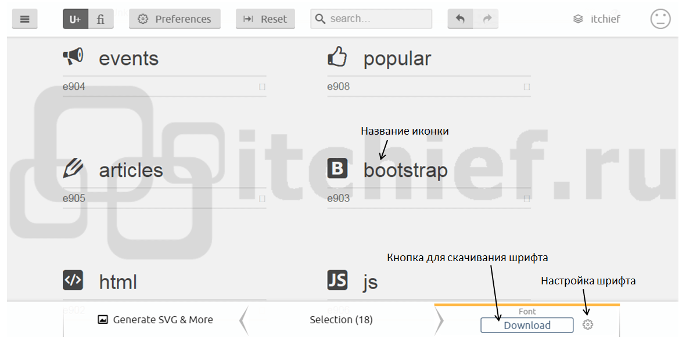

# Урок 19.Створення SVG іконок. FontAwesome

### Мета:

* навчитися готувати та застосовувати іконочні шрифти в проекті
* розвивати комбінаторне мислення та навички рішення нестандартних ситуацій
* виховувати прагнення до полегшення ваги проекту

### І. Організація навчального процесу

Перевірка якості зв'язку та присутності студентів на занятті. Пропонуємо всім запустити редактор коду.

### ІІ. АОЗ

1. Пригадайте, як можна підключити шрифти до проекту?
2. Які формати зображень можна використовувати на сайті і як?


1. В чому різниця між CSS-анімацією та властивістю `transform`?
2. Як змінюються елементи при застосуванні властивості `transform`?
3. Які ключові кадри можна вказувати для CSS-анімації?
4. Коли варто використовувати затримку анімації?

### ІІІ. Повідомлення теми та мети уроку

Сьогодні ми з вами навчимося створювати власні SVG іконки та застосовувати "іконочні" шрифти в проектах.

### IV. Повідомлення нового матеріалу

Іконочний шрифт являє собою звичайний шрифт, в якому замість традиційних символів використовуються значки \(іконки\). Використання конок в такому форматі є дуже привабливим рішенням для розробників:

* такими іконками дуже просто керувати, тобто змінювати їх розмір, колір та інші параметри. Здійснюється це за допомогою тих же CSS-властивостей, які застосовуються для стилізації звичайного тексту \(`font-size`, `color` та ін.\)
* іконки знаходяться в векторному форматі. Це означає те, що вони добре масштабуються та відмінно виглядають на екранах пристроїв з високою роздільною здатністю
* шрифт - це стиснутий формат, а це означає, що для його завантаження потрібно значно менше часу, ніж аналогічних векторних зображень
* шрифтові іконки підтримуються всіма браузерами. Здійснюється це завдяки створенню на базі одного пакету шрифтів у різних форматах: `eot`, `ttf`, `svg`, `woff`.

Пропоную детальніше ознайомитись із наступними ресурсами іконочних шрифтів:

* [IcoMoon](https://icomoon.io/app/#/select)
* [FontAwesome](https://fontawesome.com/)
* [Fontello](http://fontello.com/)
* [glyphsearch.com](https://glyphsearch.com/)


[Приклад](https://codepen.io/mediol-git/pen/gOWGLoB?editors=1100) реалізації іконок соц. мереж.


Давайте розглянемо, як додати соціконки, використовуючи ресурс IcoMoon.

#### Алгоритм створення шрифта в IcoMoon App

1. Перейти на сторінку [IcoMoon App](https://icomoon.io/app/#/select).
2. Ввести назву проекту \(значок "Manage Projects"\).
3. Додати в проект за необхідності шрифт Font Awesome \(кнопка з трьома полосками -&gt; Icon Library\).
4. Додати до проекту пустий набір, який можна використовувати для розміщення в ньому своїх іконок \(кнопка з трьома полосками -&gt; New Empty Set\).
5. дати назву щойно створеному набору.
6. Додати в набір власні значки.
7. Обрати іконки, які необхідно додати у вихідний набір, за допомогою інструмента "Select".
8. Виконати генерацію шрифта.
9. Натиснути на значок шестерні і в діалоговому вікні ввести назву шрифта \(Font Name\), префікс класу \(Class Prefix\), обрати опцію "Use a class" \(Використати клас\) і вказати в полі значення ".icon".
10. Натиснути на кнопку "Download".




#### Підключення іконок у форматі шрифта до проекту

Для встановлення іконочного шрифта  необхідно розпакувати архів, створений сайтом IcoMoon, і перенести з нього в робочий проект папку `fonts` \(шрифти\) і файл `"style.css"`.

Підключення шрифта до проекту і класів для зручної роботи з ним здійснюється через файл `"style.css"`.

```text
<!-- fonts - шлях до файлу style.css -->

<link href="fonts/style.css" rel="stylesheet">
```

Використання іконок на сторінці

Для верстки блоку з іконками використовуємо тег для створення однотипних елементів - список ul

```text
<ul class="social-networks">
   <li>
        <a href="#" target=”_black”><i class="icon-events"></i></a>
    </li>
    ...
</ul>
```

Застосування іконок створеного шрифта на сторінці здійснюється за допомогою елемента `i`, до якого необхідно додати базовий клас `icon` \(визначається на основі налаштування "Use a class"\) і клас іконки.

### V. Засвоєння теоретичних знань на практиці

Для закріплення нових знань на практиці пропоную разом зверстати секцію "Meet our agents" із тренувального макету. В цій секції ми підключимо іконочний шрифт.



### VI. Узагальнення отриманих навичок

1. В яких форматах може бути представлений іконочний шрифт?
2. Які переваги підключення таких шрифтів?
3. Як підключити іконочний шрифт до проекту?

### VII. Домашнє завдання

Зверстати проект за технологією Mobile first відповідно до макету нижче:

* [mobile](https://app.schoology.com/attachment/1690243730/source/845739c21f8087eb0f318890c127a4a5.psd)
* [tablet](https://app.schoology.com/attachment/1690243729/source/f44ed1dbb4584ed3c216a72f5f703be7.psd)
* [desktop](https://app.schoology.com/attachment/1690243728/source/4f781214ed287ae242924753a4e57ce4.psd)

