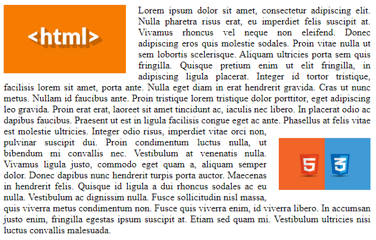

# Урок 21. Потік документа. Властивість overflow.

### Мета:

* навчитися розуміти логіку роботи стилів у браузерах та впливати на них.
* розвивати навички поняття блочної моделі документа
* виховувати педантичне ставлення до написання коду та практику використання коментарів

### І. Організація навчального процесу

Перевірка готовності учнів до уроку. Відповіді на запитання учнів стосовно ДЗ. Налагодження діалогу.

### ІІ. АОЗ

1. Що дає нам властивість `box-sizing: border-box;`
2. Які параметри властивості `border` ви знаєте? Пригадайте їх синтаксис.
3. Охарактеризуйте блочну модель поведінки елементів.

### ІІІ. Повідомлення теми та мети уроку.

Сьогодні ми продовжимо вивчати таблиці стилів та дізнаємося про потік документа як можна його змінити.

### IV. Мотивація

Змінюючи потік документа ви змінюєте історію проекту з ніг на голову та досягаєте дивовижних результатів у відтворені дизайну сайту.

### V. Вивчення нового матеріалу

#### Потік документа

Базовий потік - це спосіб, за яким елементи розмітки розташовуються на веб-сторінці по дефолту. вони розташовуються один за одним: блочні - зверху вниз, а рядкові - зліва направо, якщо до них не застосували CSS правила для зміни їх поведінки.

Навіть без застосування CSS правил, HTML документ вже має власні правила:

* гнучкість - як елементи адаптуються до розмірів браузера
* послідовність - порядок появи елементів

```text
<body>
  <div>1</div>
  <div>2</div>
  <div>3</div>
</body>
```


* накладання - як елементи з'являються один над одним

```text
<main>
  Цей елемент знаходиться позаду інших елементів.
  <div>
    Цей вкладений елемент належжить до уявного шару, який знаходиться поверх батьківського шару.
    <span>Цей елемент ближче до нас. Його шар розташований над шаром вже його батька.</span>
  </div>
</main>
```

#### Порушення потоку

Хоч стандартна поведінка браузера є ефективною, цього буває не достатньо для потреб дизайну. Деякі CSS властивості дозволяють порушити потік:

* `height` і `width` можуть змінити гнучкість елемента;
* `float` порушує поведінку елемента та його оточення;
* значення `absolute` і `fixed` у властивості`position` видаляють елемент із потоку \(вивчимо на наступному уроці\);
* `z-index` може змінювати порядок накладання елементів.

#### Властивість `oveflow`

Дана властивість керує тим, як веде себе вміст блочного елемента, якщо його розмір перевищує допустиму ширину. Зазвичай блок збільшується в розмірах, коли до нього додаються інші елементи, включаючи в себе всіх нащадків. Але що, коли висота та ширина явно вказані \(фіксовані розміри\)? В такому випадку блок не може збільшитися і контент переповнює його. Відображення такого контенту задається властивістю `overflow`.

Властивості `overflow-x/overflow-y` \(або обидва одночасно: `overflow`\) визначають поведінку контейнера при його переповненні.

| property: | comment |
| :--- | :--- |
| **visible** | За замовчуванням, контент виглядає за межі блоку. |
| **hidden** | Зайвий контент не видно. |
| **auto** | Полоса прокрутки при переповненні. |
| **scroll** | Полоса прокрутки завжди. |

Крім того, значення  `overflow: auto | hidden` змінює поведінку контейнера, в якому є `float'и`. Так як елемент з `float` знаходиться поза потоком, то зазвичай контейнер не виділяє для нього місце. Але, якщо задано таке значення overflow, то місце виділяється, тобто контейнер розтягується.

[Зразок коду для практичного засвоєння знань](https://codepen.io/mediol-git/pen/mdmPgBr?editors=1100)

### VI. Засвоєння теоретичних знань на практиці

Для практичного засвоєння теоретичного матеріалу варто разом із учнями написати код наступного виду - [https://codepen.io/mediol-git/pen/LYyGLrK](https://codepen.io/mediol-git/pen/LYyGLrK).

### VI. Узагальнення нового матеріалу

1. Що вважається потоком документом?
2. Які правила має HTML-документ без застосування CSS-стилів?
3. Для чого іноді порушують потік елементів?
4. Як можна припинити обтікання елементів? Розкажіть про той спосіб, що вам сподобався більше.

### VII. Домашнє завдання

Створіть блок за зразком:



Зображення [тут](https://github.com/olgamaslovaolga/Alevel-Markup/raw/master/images/hw-6.2.1.png) і [тут](https://github.com/olgamaslovaolga/Alevel-Markup/raw/master/images/hw-6.2.png).

