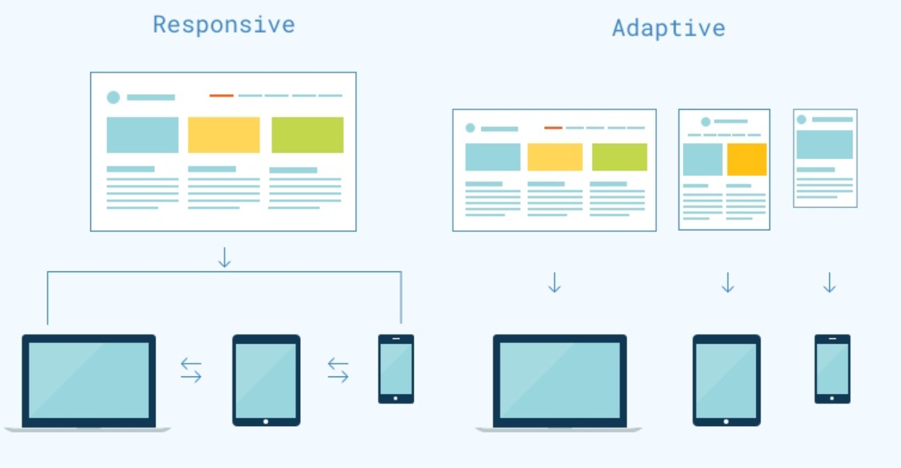
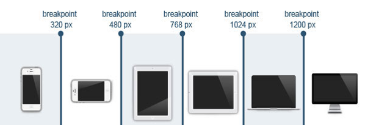

# Урок 23. Adaptive & Responsive.

### Мета:

* навчитися розуміти різні підходи адаптивної верстки та основні її принципи
* розвивати навички правильного застосування медіа-запитів та побудови розмітки, враховуючи майбутню адаптивність
* виховувати мінімалістичні дизайнерські смаки у сфері веб-розробки

### І. Організація навчального процесу

Перевірка готовності учнів до уроку. Відповіді на запитання учнів стосовно ДЗ. Налагодження діалогу.

### ІІ. АОЗ

1. Які переваги flex-box технології ви знаєте?
2. Як можна змінити напрям осей flex-контейнера?
3. Нагадайте властивості для вирівнювання flex-елементів.

### ІІІ. Повідомлення теми та мети уроку

На сьогодні близько 80% усього інтернет трафіку припадає на мобільні пристрої. Тому, адаптація сайтів є нашою першочерговою задачею. Сьогодні ми познайомимося із принципами адаптивної верстки та навчимося застосовувати ці принципи на практиці.

### IV. Вивчення нового матеріалу

Сучасна верстка змінює дизайн сторінки в залежності від поведінки користувача, платформи, розміри екрану та орієнтації девайсу і є невід'ємною частиною сучасної веб-розробки.

Адаптивна верстка дозволяє суттєво заощаджувати час і не відтворювати новий дизайн для кожного девайсу, а змінювати розміри та розташування окремих елементів.

Це дозволяє забезпечити зручний дизайн для будь-якого пристрою без необхідності створення декількох різних сайтів.

Сьогодні все рідше можна зустріти сайт без адаптивності чи мобільної версії.


**Давайте розберемося з основними поняттями варіантів адаптивності сторінки:**

1\) **Фіксована верстка** - блоки не змінюють ширину. На моніторах малого розміру з'являється горизонтальна полоса прокрутки. В наш час застаріла та використовується вкрай рідко.

2\) **Гнучка верстка** - блоки змінюють свою ширину в залежності від ширини браузера. Ширина може набувати максимального та мінімального значення.

3\) **Адаптивна \(adaptive\) верстка** - втілюється за допомогою `@media`. Ключовими є пристрої з шириною 320, 768, 1024 і т.д. Будь-яка зміна відбувається ривками, по досягненню одного з вказаних рівнів.

4\) **Чутлива \(responsive\) верстка** - це такий підхід до створення веб-сторінки, за якого **зовнішній вигляд веб-сторінки визначається через CSS, базуючись на ширині вікна браузера.** Це є поєднання гнучкої та адаптивної верстки. В реалізації - найважча. Але результат виходить найбільш придатний. Можна з впевненістю сказати, що сайт пристосується до будь-якого пристрою.

Чутливий тип макетів веб-сторінок базується на принципі "гуми", але також використовує медіа-запити для пристосування контенту під ширину пристрою. В свою чергу. адаптив "плигає" по контрольних точках, зміщуючись та адаптуючи контент кожного разу до найближчої з них. Тобто, медіа-запити описують фіксовані положення контенту для кожної з контрольних точок. В результаті ми маємо набір із декількох фіксованих макетів для роботи з різними розмірами екранів.



Пошукові системи використовують ряд критеріїв для оцінки адаптивності сайту при перегляді на мобільних пристроях. Google намагається спростити користування Інтернетом для власників смартфонів та планшетів, помічаючи у видачі адаптовані сайті спеціальною міткою mobile-friendly.

В Яндексі теж працює алгоритм, який віддає перевагу сайтам з мобільною/адаптивною версією для користувачів у мобільному пошуку. Також варто проаналізувати сайт за допомогою інструмента PageSpeed Insights. Він дозволяє виявити фактори, які уповільнюють швидкість завантаження сторінки або перешкоджають комфортній взаємодії з веб-сторінками.

#### Типи девайсів

Якщо згрупувати всі девайси, то отримаємо:

* Mobile:
  * portrait \(320px - 414px\) - пристрої з екранами від 4 до 6,9 дюймів;
  * landscape \(568px - 812px\) - те ж саме, тільки в перевернутому стані;
* Tablet:
  * portrait \(768px - 834px\) - пристрої від 7 до 10 дюймів
  * landscape \(1024px - 1112px\)



#### CSS-інструменти для responsive

В адаптивному веб-дизайні використовуються:

* гнучкі grid-системи
* масштабовані зображення
* спеціальні медіа-запити CSS-\(@media\)

#### Гнучка сітка

Гнучка сітка життєво необхідна. Потрібна розмітка, яка може розширятись та звужуватись \(разом із контентом\), налаштовуючись під екран конкретного пристрою.

CSS3 ввели декілька нових відносних одиниць довжини, зокрема, пов'язаних з розміром області перегляду браузера або пристрою. Ці одиниці включають  `vw`, `vh`, `vmin` и `vmax`.

 `vw` - ширина області перегляду

`vh` - висота області перегляду

`vmin` - менше значення з ширини та висоти області перегляду

`vmax` - більше значення з ширини та висоти області перегляду

#### Масштабовані зображення

```text
img {
    display: block;
    width: 100%;
    max-width: 100%;
} 
```

Проблема гнучких зображень вирішується за допомогою глобальних стилів для всіх картинок на сайті. Це правило гарантує, що зображення ніколи не будуть ширші за їх контейнери та ніколи не перевищать свої вихідні розміри на великих екранах.

#### Медіа-запити

Таке поняття як медіа-запити, з'явилося в CSS3. З їх допомогою можна визначати зовнішній вигляд веб-сторінки, спираючись на ширину і висоту вікна браузера. Завдяки медіа-запитам ми можемо паралельно створювати стилі для невеликих мобільних телефонів, планшетів, лептопів та моніторів з великою діагоналлю.

Як правило, для адаптації дизайну веб-сторінки необхідно прописати ряд CSS-стилів для певних елементів. Далі перелічимо найбільш популярні сценарії, коли доводиться використовувати медіа-запити:

* визначення кількості колонок
* відносна ширина
* зменшення відступів
* регулювання розміру шрифта
* адаптивна навігація
* приховування елементів

#### Breakpoints \(контрольні точки\)

За допомогою медіа-запитів ми можемо створювати так звані контрольні точки та прив'язувати до них CSS-стилі.

Наприклад, можна визначити для браузера наступні стилі:

> якщо ширина екрану більша ніж 768рх, до веб-сторінки застосовуються одні стилі, а якщо ширина екрану більша за 991рх, застосовуються інші стилі.

Саме ці числа називаються **контрольними точками**.


Існує два підходи responsive верстки:

* від малих екранів до великих - **Mobile first**
* від великих до малих - **Desktop first**


Розглянемо синтаксис медіа-запитів в таких випадках:

```text
-------------------------------------------------------------- 
------   Від малих екранів до великих ( Mobile First )  ------ 
-------------------------------------------------------------- 

/* Стилі для дуже малих екранів (телефони в книжній оріентації, дисплей менше 576рх). Записуються без медіа-запитів */

/* Стилі для малих екранів (телефони в альбомній оріентації, дисплей 576рх і більше) */
@media (min-width: 576px) { ... }

/* Стилі для середніх екранів (планшети, дисплей 768рх і більше) */
    @media (min-width: 768px) { ... }

/* Стилі для великих екранів (ПК, дисплей 992рх і більше) */
    @media (min-width: 992px) { ... }

/* Стилі для дуже великих екранів (ПК з великим монітором, дисплей 1200рх і більше) */
    @media (min-width: 1200px) { ... }
```

```text
--------------------------------------------------------------- 
------   Від великих екранів до малих (Desktop First)   -------
---------------------------------------------------------------

/* Стилі для дуже великих екранів (дисплей 1200рх і більше).
Записуються без медіа-запитів, тому що контрольна точка не має верхньої межі. */

/* Стилі для великих екранів (дисплей максимум 1199рх) */
    @media (max-width: 1199px) { ... }

/* Стилі для середніх екранів (дисплей максимум 991рх) */
    @media (max-width: 991px) { ... }

/* Стилі для малих екранів (дисплей максимум 767рх) */
    @media (max-width: 767px) { ... }

/* Стилі для дуже малих екранів (дисплей максимум 575рх) */
    @media (max-width: 575px) { ... }
```

Також існує синтаксис запису медіа-запитів \(за допомогою оператора **and**\), який визначає конкретний діапазон, для якого будуть застосовані стилі:

```text
/* Стилі для малих екранів (дисплей шириною від 576рх до 767рх) */
@media (min-width: 576px) and (max-width: 767px) { ... }
```

### V. Засвоєння теоретичних знань на практиці

Під час пояснення нового матеріалу пропоную адаптувати другу та третю секції макету для тренувань.



### VI. Узагальнення нових знань

1. Пригадайте та охарактеризуйте варіанти адаптиву веб-сторінки.
2. В чому полягає робота responsive верстки?
3. Які інструменти є для чутливої верстки?
4. В чому різниця між Mobile first & Desktop first?
5. Який синтаксис запису медіа-записів?

### VII. Домашнє завдання

Адаптувати макет із ДЗ до попереднього заняття та викласти результат в Scoology.

