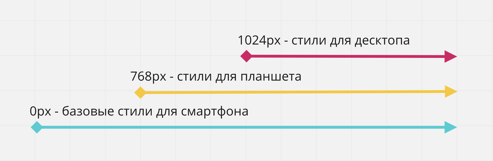
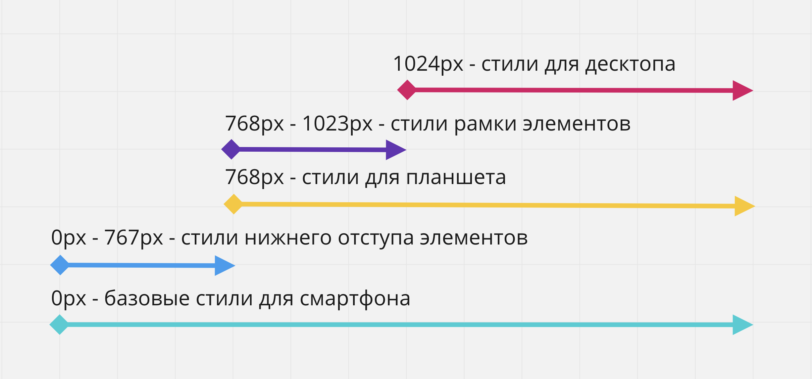

# Урок 24. Mobile first верстка

### Мета:

* детально вивчити принципи технології Mobile First
* розвивати навички правильного застосування медіа-запитів та побудови розмітки, враховуючи майбутню адаптивність
* виховувати мінімалістичні дизайнерські смаки у сфері веб-розробки

### І. Організація навчального процесу

Перевірка готовності учнів до уроку. Відповіді на запитання учнів стосовно ДЗ. Налагодження діалогу.

### ІІ. АОЗ

1. У чому різниця між медіазапитами та контрольними точками?
2. Що значить термін Responsive?

### ІІІ. Повідомлення теми та мети уроку

Сьогодні ми з вами навчимося верстати макет саме за технологією Mobile First, так як вона має багато переваг у питаннях прискорення швидкості завантаження веб-сторінок.

### IV. Вивчення нового матеріалу


Існує два підходи responsive верстки:

* від малих екранів до великих - **Mobile first**
* від великих до малих - **Desktop first**


Розглянемо синтаксис медіа-запитів в таких випадках:

```text
--------------------------------------------------------------- 
------   Від великих екранів до малих (Desktop First)   -------
---------------------------------------------------------------

/* Стилі для дуже великих екранів (дисплей 1200рх і більше).
Записуються без медіа-запитів, тому що контрольна точка не має верхньої межі. */

/* Стилі для великих екранів (дисплей максимум 1199рх) */
    @media (max-width: 1199px) { ... }

/* Стилі для середніх екранів (дисплей максимум 991рх) */
    @media (max-width: 991px) { ... }

/* Стилі для малих екранів (дисплей максимум 767рх) */
    @media (max-width: 767px) { ... }

/* Стилі для дуже малих екранів (дисплей максимум 575рх) */
    @media (max-width: 575px) { ... }
```

Також існує синтаксис запису медіа-запитів \(за допомогою оператора **and**\), який визначає конкретний діапазон, для якого будуть застосовані стилі:

```text
/* Стилі для малих екранів (дисплей шириною від 576рх до 767рх) */
@media (min-width: 576px) and (max-width: 767px) { ... }
```

Історично склалося так, що дизайнери починали розробку дизайну сайту для великого екрану, тобто перший і «головний» дизайн робився для робочого столу комп'ютера, так як передбачає більшу функціональність.

Проблема такого підходу в тому, що пріоритет віддається користувачам комп'ютерів і ноутбуків, хоча зараз, за статистикою, домінує мобільний трафік. багато елементи дизайну і функціоналу, які відмінно виглядають і працюють на робочому столі комп'ютера, досить складно перенести на мобільний екран.

стратегія **Mobile First** йде від зворотного - спочатку робиться мобільна версія, після чого планшетні і десктопна. Це робить актуальну інформацію легко доступною і дозволяє приховати або змінити елементи на будь-якому екрані.

Веб-сайт повинен бути добре оптимізований для пошукових систем \(SEO\) і відповідати всім вимогам UX \(user experience\), що б прибування користувача на сайті було максимально зручним і зрозумілим через його мобільний пристрій. Тому одні з найважливіших вимог в Mobile First розробці це:

* Показати найважливіший зміст в першу чергу.
* Веб-сайт повинен бути легковажним і оптимізованим, бо швидкість підключення мобільної мережі може бути слабкою в залежності від місцезнаходження користувача.
* Веб-сайт не повинен завантажувати більше ресурсів, ніж потрібно користувачеві для отримання потрібної інформації.
* Додаткова інформація повинна завантажуватися тільки на вимогу користувача.

При розробці веб-сайту у такого підходу є великі переваги.

* **Один веб-сайт** - для всіх пристроїв тільки один проект. Скорочує необхідну кількість розробників.
* **Зручність інтерфейсу** - користувачі отримають важливий зміст сторінки в першу чергу.
* **Швидкість завантаження** - сторінка буде завантажуватися швидше на мобільних пристроях через те, що кількість завантажених і відображених ресурсів буде менше.
* **Рейтинг в пошуку** - наприклад Google не тільки віддає пріоритет сайтам, оптимізованим для мобільних пристроїв, але і враховує час відкриття сторінок.

### Mobile-first CSS[\#](https://goit.global/html-css/ua/v1/docs/lesson-15/mobile-first#mobile-first-css)

Технічно реалізація Mobile First досить проста - стилі для мобільних пристроїв це базові стилі поза медіа-запитів, після чого, для кожної точки перелому добавялется медіа-запит в якому перевизначаються необхідні базові стилі, стилі з попереднього проміжку або додаються нові. Тому в медіа-запитах, в основному, використовується медіа-функція `min-width`.

```text
-------------------------------------------------------------- 
------   Від малих екранів до великих ( Mobile First )  ------ 
-------------------------------------------------------------- 

/* Стилі для дуже малих екранів (телефони в книжній оріентації, дисплей менше 576рх). Записуються без медіа-запитів */

/* Стилі для малих екранів (телефони в альбомній оріентації, дисплей 576рх і більше) */
@media (min-width: 576px) { ... }

/* Стилі для середніх екранів (планшети, дисплей 768рх і більше) */
    @media (min-width: 768px) { ... }

/* Стилі для великих екранів (ПК, дисплей 992рх і більше) */
    @media (min-width: 992px) { ... }

/* Стилі для дуже великих екранів (ПК з великим монітором, дисплей 1200рх і більше) */
    @media (min-width: 1200px) { ... }
```

Тобто створюється легка версія стилів для мобільних пристроїв, а всі стилі для більш широких екранів закриваються всередині відповідних медіа-запитів. При цьому HTML-розмітка не змінюється.

Плюс такого підходу в тому, що для мобільних стилів практично ніколи не потрібно задавати позиціонування, наприклад за допомогою Flexbox, тому що весь контент йде в одну колонку один за одним - дефолтну поведінку блокових елементів в стандартному потоці документа. Це означає, що в медіа-запитах для більш широких екранів, не доведеться перевизначати позиціонування.

На ілюстрації нижче показано структура медіа-запитів і стилів для простої сторінки з 2-ма точками перелому `768px` і `1024px`. CSS-правила всередині медіа-запитів просто додають нові стилі або скасовують попередні.



**Плюси такої верстки:**

* Базовий CSS-код чистіший, так як нам допомагає потік документа і блокова модель при позиціонуванні елементів інтерфейсу.
* Спадкування стилів від вузьких до широких екранів.
* Мінімальна перевизначення стилів позиціонування, що випливає з першого пункту.

### Медіа-функція `max-width`

Для більшості ситуацій досить використовувати `min-width` і додати або перевизначити стилі. Проте, бувають ситуації коли використання медіа-функції `max-width` робить код чистішим і читабельнішим.

Уявімо таку ситуацію - в останньому прикладі елементів необхідно додати нижній відступ тільки на мобільному пристрої, тобто до `767px` \(з 768 починаються стилі планшета\). А для планшетного проміжку, від `768px` до `1023px`, необхідно щоб у елементів з'являлася рамка.

Використання тільки `min-width` приведе до того, що в стилях медіа-запиту c `min-width: 768px` доведеться обнулити нижній відступ елементів. А в стилях медіа-запиту з `min-width: 1024px` будемо обнуляти стилі рамки. Чи не найкраще рішення,

```text
<!-- ПОГАНО -->

// styles.css
.box {
  margin-bottom: 10px;
}

@media (min-width: 768px) {
  .box {
    margin-bottom: 0;
    border: 1px solid black;
  }
}

@media (min-width: 1024px) {
  .box {
    border: none;
  }
}

<!-- ДОБРЕ -->

// styles.css
@media (max-width: 767px) {
  .box {
    margin-bottom: 10px;
  }
}

@media (min-width: 768px) and (max-width: 1023px) {
  .box {
    border: 1px solid black;
  }
}
```

У таких ситуаціях гарною практикою буде закрити специфічні стилі в певного проміжку, і допоможе нам в цьому медіа-функція `max-width`.



### V. Засвоєння нових знань на практиці

Для тренування та закріплення нових знань. пропоную зверстати перші дві секції макету: [https://www.figma.com/file/nAsaQE6gK3EUMjSHqWNA53/FindYourJob](https://www.figma.com/file/nAsaQE6gK3EUMjSHqWNA53/FindYourJob) за технологією Mobile first та адаптувати його під tablet & desktop.

### VI. Узагальнення та систематизація знань

### VII. Домашнє завдання

