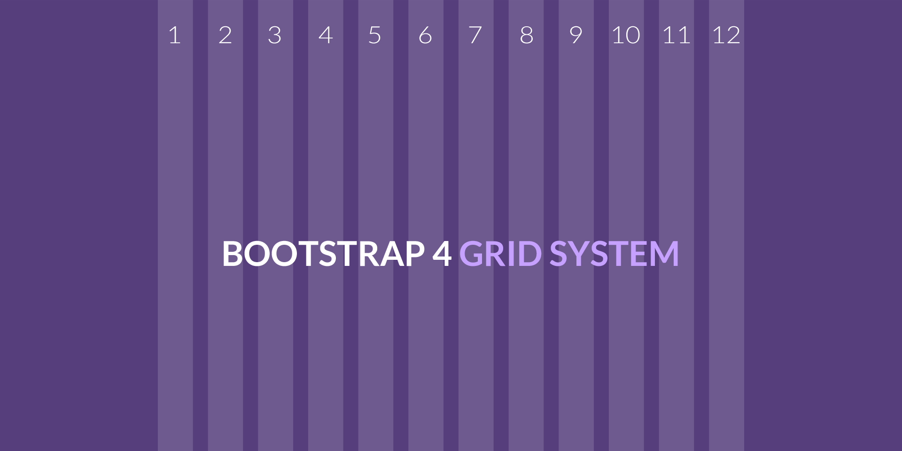
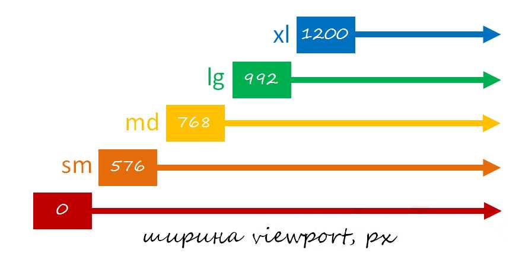
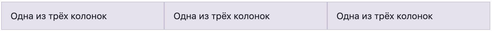
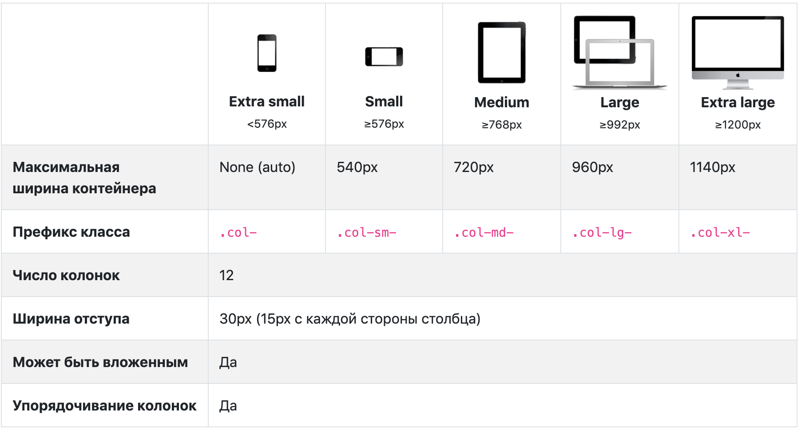
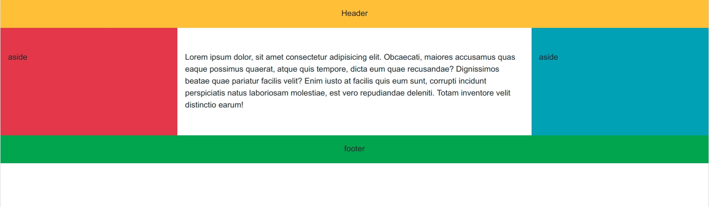
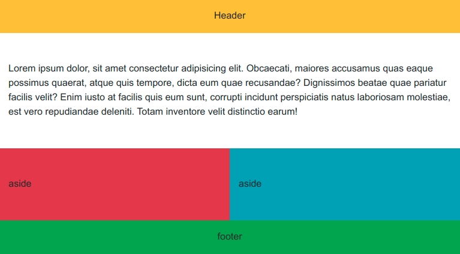
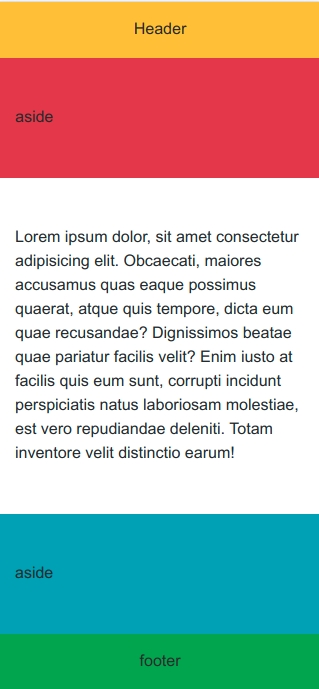

# Урок 26. Bootstrap - установка та розмітка

### Мета:

* познайомитись із новими технологіями розробки сайтів 
* розвивати навички використання сучасного фреймворка у реальних проектах
* виховувати повагу до чужих розробок

### І. АОЗ

1. Як зазвичай називають кнопку для мобільного меню?
2. Як можна відстежити натискання "бургер" кнопки?
3. У яких випадках варто основне меню перетворювати на мобільне?

### ІІ. Оголошення теми. мети та завдань уроку

Сьогодні ми познайомимось із новими технологіями розробки сайтів. Ми дізнаємося про фреймворки, а зокрема попрацюємо із Bootstrap.

### ІІІ. Вивчення нового матеріалу

Фреймворк - це каркас або заготовка для розробника. Тобто, це потужний набір бібліотек і готових інструментів, який дозволяє нам розробляти різноманітне ПЗ будь-якої складності, створювати веб-додатки і т.д. Все це дає змогу витрачати менше зусиль та часу.

Плюси фреймворків:

* прискорення та зручність розробки
* кросбраузерність
* скорочення затрат на створення проекту
* можливість створювати коректний HTML макет навіть не дуже досвідченому спеціалісту
* оптимізація робочого часу

Простіше кажучи, замість того, щоб писати сотні рядків коду достатньо викликати декілька команд або методів і робота готова.

Але, в нашому світі немає нічого ідеального. Саме тому, у фреймворків є **недоліки**:

* прив'язаність до стилів CSS бібліотеки
* надлишковий код
* складність опанування

Як ви здогадались, фреймворків існує достатня кількість. Та ми з вами вивчимо один із найпопулярніших, який використовується розробниками у всьому світі. Це - **Bootstrap**.

Він складається за:

* розмітки
* класів для стилізації тексту, зображень. блоків, таблиць а ін
* компонентів призначених для створення кнопок, форм, меню, слайдерів, списків і т.д.
* класів для вирішення допоміжних задач типу: вирівнювання тексту, приховування елементів, колір, фон, відступи та ін.

#### Установка

**Швидкий спосіб \(Bootstrap CDN\)**

Достатньо вставити наступний код в розділ `<head>`

```text
<link href="https://cdn.jsdelivr.net/npm/bootstrap@5.0.2/dist/css/bootstrap.min.css" rel="stylesheet" integrity="sha384-EVSTQN3/azprG1Anm3QDgpJLIm9Nao0Yz1ztcQTwFspd3yD65VohhpuuCOmLASjC" crossorigin="anonymous">
```

А для активації плагінів, требв розмістити наступний код в кінці сторінки перед закриваючим тегом `</body>`

```text
<script src="https://cdn.jsdelivr.net/npm/@popperjs/core@2.9.2/dist/umd/popper.min.js" integrity="sha384-IQsoLXl5PILFhosVNubq5LC7Qb9DXgDA9i+tQ8Zj3iwWAwPtgFTxbJ8NT4GN1R8p" crossorigin="anonymous"></script>
<script src="https://cdn.jsdelivr.net/npm/bootstrap@5.0.2/dist/js/bootstrap.min.js" integrity="sha384-cVKIPhGWiC2Al4u+LWgxfKTRIcfu0JTxR+EQDz/bgldoEyl4H0zUF0QKbrJ0EcQF" crossorigin="anonymous"></script>
```

Базовий шаблон сторінки буде виглядати таким чином:

```text
<!doctype html>
<html lang="ru">
  <head>
    <!-- Обязательные метатеги -->
    <meta charset="utf-8">
    <meta name="viewport" content="width=device-width, initial-scale=1">

    <!-- Bootstrap CSS -->
    <link href="https://cdn.jsdelivr.net/npm/bootstrap@5.0.2/dist/css/bootstrap.min.css" rel="stylesheet" integrity="sha384-EVSTQN3/azprG1Anm3QDgpJLIm9Nao0Yz1ztcQTwFspd3yD65VohhpuuCOmLASjC" crossorigin="anonymous">

    <title>Привет мир!</title>
  </head>
  <body>
    <h1>Привет мир!</h1>

    <!-- Дополнительный JavaScript; выберите один из двух! -->

    <!-- Вариант 1: Bootstrap в связке с Popper -->
    <script src="https://cdn.jsdelivr.net/npm/bootstrap@5.0.2/dist/js/bootstrap.bundle.min.js" integrity="sha384-MrcW6ZMFYlzcLA8Nl+NtUVF0sA7MsXsP1UyJoMp4YLEuNSfAP+JcXn/tWtIaxVXM" crossorigin="anonymous"></script>

    <!-- Вариант 2: Bootstrap JS отдельно от Popper
    <script src="https://cdn.jsdelivr.net/npm/@popperjs/core@2.9.2/dist/umd/popper.min.js" integrity="sha384-IQsoLXl5PILFhosVNubq5LC7Qb9DXgDA9i+tQ8Zj3iwWAwPtgFTxbJ8NT4GN1R8p" crossorigin="anonymous"></script>
    <script src="https://cdn.jsdelivr.net/npm/bootstrap@5.0.2/dist/js/bootstrap.min.js" integrity="sha384-cVKIPhGWiC2Al4u+LWgxfKTRIcfu0JTxR+EQDz/bgldoEyl4H0zUF0QKbrJ0EcQF" crossorigin="anonymous"></script>
    -->
  </body>
</html>
```

**Другий варіант встановлення** - завантажити його [тут](https://getbootstrap.com/docs/4.4/getting-started/download/)

#### Розмітка

В Bootstrap використовується система "12 колонок". Сітка базується на CSS Flexbox та медіа-запитах.



Bootstrap містить в собі responsive **mobile first сітку.** Вона, в свою чергу, містить заздалегідь визначені класи для легкості створення семантичної розмітки.

На схемі показано основні контрольні точки, які використовує Bootstrap



| Ширина viewport браузера | Контрольна точка \(назва пристрою\) |
| :--- | :--- |
| &gt;=0 | без позначення\(xs\) |
| &gt;=576px | "sm" |
| &gt;=768px | "md" |
| &gt;=992px | "lg" |
| &gt;=1200px | "xl" |

Сітка Bootstrap 4 - це основна частина фреймворку. Вона складається з:

* контейнерів \(елементів з класом `container` та `container-fluid`\)
  * .container - призначений для створення адаптивно-фіксованого макету
  * .container-fluid - для адаптивно-чутливого макету
* рядків \(елементів з класом `row`\)
  * створює від'ємні відступи по горизонталі \(margin\) по 15рх
  * виконує функцію флекс-контейнера
* адаптивних блоків \(елементів із декількома класами `col`, або що починаються на `col`\)
  * флекс-елементи
  * основні елементи сітки

Усе це звичайні HTML елементи, до яких просто додані певні класи. А вже до класів написані потрібні стилі.



```text
<div class="container">
  <div class="row">
    <div class="col-sm">
      Одна з трьох колонок
    </div>
    <div class="col-sm">
      Одна з трьох колонок
    </div>
    <div class="col-sm">
      Одна з трьох колонок
    </div>
  </div>
</div>

<!-- Що отримали: за допомогою класів сітки було створено 3 колонки одинакової ширини для маленьких,
середніх і великих девйасів. Ці колонки вирівняні за допомогою батьківського класу .container. -->
```

Поглянемо, як діють деякі аспекти системи сіток Bootstrap на пристроях із різною шириною



Наприклад, нижче ми бачимо дві сітки, які підійдуть до будь-якого пристрою та зоні видимості від xs до xl. Додавай будь-яку кількість простих класів для кожного брекпойнту і кожна колонка буде однакової ширини.

```text
<div class="container">
  <div class="row">
    <div class="col">
      1 з 2
    </div>
    <div class="col">
      2 з 2
    </div>
  </div>
  <div class="row">
    <div class="col">
      1 з 3
    </div>
    <div class="col">
      2 з 3
    </div>
    <div class="col">
      3 з 3
    </div>
  </div>
</div>
```

#### Етапи створення веб-сторінки з Bootstrap:

1. Створюємо основні семантичні блоки типу header, main, footer, section
2. У середині кожного з них створюємо контейнер
3. У контейнерах пишемо рядки
4. В кожному ряду створюємо розмітку за допомогою адаптивних блоків
5. Повторюємо пункти 3-4 доки не буде готовий повний макет сторінки.

### IV. Засвоєння нових знань на практиці

Створюємо адаптивну верстку примітивного макету на Bootstrap без використання стилів.

**Десктоп**



**Планшет**



**Мобайл**  




### V. Узагальнення вивченого матеріалу

* З яких блоків складається сітка Bootstrap?
* Яка послідовність створення веб-сторінки на Bootstrap?
* Яка роль елемента з класом `.row`?
* Які класи адаптивних елементів яким розмірам відповідають?

### VI. Домашнє завдання

Написати розмітку сайту на Bootstrap по макету: [https://www.figma.com/file/6YpMnUKT3N9ZQCd9pB82sX/Untitled](https://www.figma.com/file/6YpMnUKT3N9ZQCd9pB82sX/Untitled)

