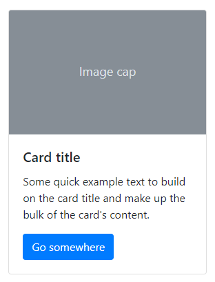
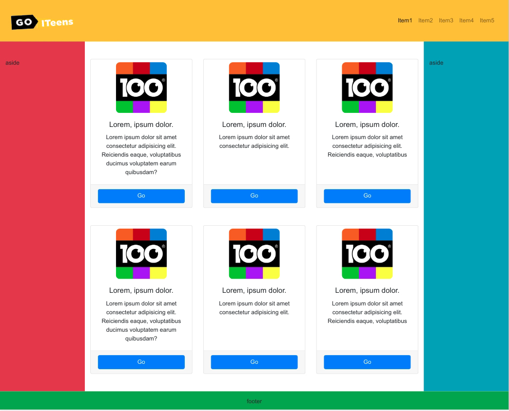
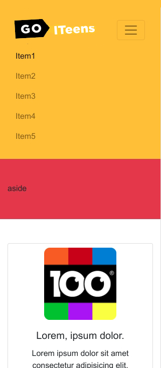

# Урок 27. Bootstrap - компоненти

### Мета:

* вивчити доступні компоненти Bootstrap
* розвивати навички доцільного використання готових компонентів фреймворка
* виховувати прагнення до мінімалізації коду

### І. АОЗ

1. Що таке фреймворк? Які його переваги та недоліки?
2. Як встановити Bootstrap у проекті?
3. Опишіть принцип побудови сітки Bootstrap.

### ІІ. Оголошення теми та мети уроку

Продовжуємо опановувати фреймворк Bootstrap. Сьогодні ми навчимося використовувати його доступні компоненти та налаштовувати їх під свій проект.

### ІІІ. Вивчення нового матеріалу

####  `breadcrumbs` \("хлібні крихти"\)

Це схема навігації, яка показує поточне розміщення користувача на сайті. В Bootstrap це звичайний упорядкований список із класом `breadcrumb`.

```text
<nav aria-label="breadcrumb">
  <ol class="breadcrumb">
    <li class="breadcrumb-item"><a href="#">Home</a></li>
    <li class="breadcrumb-item"><a href="#">Library</a></li>
    <li class="breadcrumb-item active" aria-current="page">Data</li>
  </ol>
</nav>
```

###  `buttons` \(кнопки\)

Bootstrap має деякі заздалегідь визначені стилі кнопок, кожна з яких має свою семантичну ціль і має додаткові параметри для контролю та гнучкості.


```text
<button type="button" class="btn btn-primary">Головний</button>
<button type="button" class="btn btn-secondary">Другорядний</button>
<button type="button" class="btn btn-success">Успіх</button>
<button type="button" class="btn btn-danger">Небезпека</button>
<button type="button" class="btn btn-warning">Попередження</button>
<button type="button" class="btn btn-info">Інфо</button>
<button type="button" class="btn btn-light">Світлий</button>
<button type="button" class="btn btn-dark">Темний</button>
<button type="button" class="btn btn-link">Лінк</button>

Если нужно изменить размер кнопки: 

<button type="button" class="btn btn-primary btn-lg">Велика кнопка</button>   <!--додаємо клас .btn-lg-->
<button type="button" class="btn btn-primary btn-sm">Мала кнопка</button>   <!--додаємо клас .btn-sm-->
```

####  `Card` \(карточки\)

Гнучкий та розширюваний контейнер вмісту. Карточка містить опції заголовків та підвалів, широкий спектр контенту, кольори, фони і т.д.



```text
<div class="card" style="width: 18rem;">
  
  <div class="card-body">
    <h5 class="card-title">Card title</h5>
    <p class="card-text">Some quick example text to build on the card title and make up the bulk of the card's content.</p>
    <a href="#" class="btn btn-primary">Go somewhere</a>
  </div>
</div>
```

 `Navbar` \(Навігаційна панель\)

Навбари потребують класів .navbar і .navbar-expand{-sm \| -md \| -lg \| -xl} для гнучкості.


```text
<nav class="navbar navbar-expand-lg navbar-light bg-light">
  <a class="navbar-brand" href="#">Navbar</a>
  <button class="navbar-toggler" type="button" data-toggle="collapse" data-target="#navbarSupportedContent" aria-controls="navbarSupportedContent" aria-expanded="false" aria-label="Toggle navigation">
    <span class="navbar-toggler-icon"></span>
  </button>

  <div class="collapse navbar-collapse" id="navbarSupportedContent">
    <ul class="navbar-nav mr-auto">
      <li class="nav-item active">
        <a class="nav-link" href="#">Home <span class="sr-only">(current)</span></a>
      </li>
      <li class="nav-item">
        <a class="nav-link" href="#">Link</a>
      </li>
      <li class="nav-item dropdown">
        <a class="nav-link dropdown-toggle" href="#" id="navbarDropdown" role="button" data-toggle="dropdown" aria-haspopup="true" aria-expanded="false">
          Dropdown
        </a>
        <div class="dropdown-menu" aria-labelledby="navbarDropdown">
          <a class="dropdown-item" href="#">Action</a>
          <a class="dropdown-item" href="#">Another action</a>
          <div class="dropdown-divider"></div>
          <a class="dropdown-item" href="#">Something else here</a>
        </div>
      </li>
      <li class="nav-item">
        <a class="nav-link disabled" href="#">Disabled</a>
      </li>
    </ul>
    <form class="form-inline my-2 my-lg-0">
      <input class="form-control mr-sm-2" type="search" placeholder="Search" aria-label="Search">
      <button class="btn btn-outline-success my-2 my-sm-0" type="submit">Search</button>
    </form>
  </div>
</nav>
```


І це тільки декілька компонентів. На [офіційному сайті Bootstrap](https://bootstrap-4.ru/docs/5.0/getting-started/introduction/) ви можете знайти всі доступні компоненти в однойменному розділі.

### IV. Засвоєння знань на практиці

До макету із попереднього уроку додаємо карточки товару та наповнюємо хедер логотипом та меню.

Десктоп



Телефон


Телефон - відкрита навігація



### V. Домашнє завдання

Застилити [макет, написаний на Bootstrap](https://www.figma.com/file/6YpMnUKT3N9ZQCd9pB82sX/Untitled)

