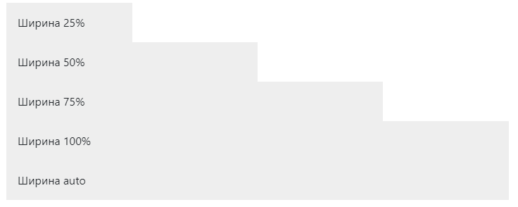
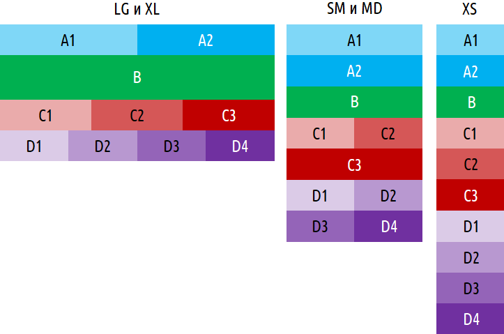

# Урок 28. Bootstrap - утиліти

### Мета:

* навчитися доповнювати розмітку утилітами фреймворка
* розвивати навички доцільного використання утиліт Bootstrap
* виховувати прагнення до мінімізації коду

### І. АОЗ

1. Які компоненти Bootstrap ви знаєте?
2. Як додати меню до проекту?

### ІІ. Повідомлення теми та мети уроку

Сьогодні останній урок по Bootstrap і ми знайомимося з його утилітами.

### ІІІ. Вивчення нового матеріалу

#### Відступи \(`Spacing`\)

Призначаємо чутливі значення `margin` та `padding` елементу за допомогою зручних класів.


Класи названі згідно формату {property}{sides}-{size}


* **property \(властивість\)** - одне з двох:
  * **m** - margin
  * **p** - padding
* **sides \(сторона\)** - одна з:
  * **t** - верх
  * **b** - низ
  * **l** - ліва
  * **r** - права
  * **x** - ліва + права
  * **y** - верх + низ
* **size \(розмір\)** - один з:
  * **1**- 0
  * **2** - 0.25
  * **3** - 0.5
  * **4** - 0.75
  * **5** - 1

#### Horizontal centering \(Горизонтальне центрування\)

Додатково, Bootstrap також включає в себе клас .mx-auto для горизонтального вирівнювання блоку відносно блоку контенту фіксованої ширини – тобто контент, якому задані display: block та набір width за допомогою горизонтальних марджинів та auto.

```text
<div class="mx-auto" style="width: 200px;">
    Відцентрований елемент
</div>
```

#### Display property \(Відображення елементів\)

Змінюємо значення властивості `display` за допомогою наших чутливих класів.


Класи називаються у форматі .d-{breakpoint}-{value}


Де

* **breakpoint \(контрольна точка\)**: sm, md, lg та xl
* **value \(значення\)** – одне з: `none`, `inline`, `inline-block`, `block`, `table`, `table-cell`, `table-row`, `flex`, `inline-flex`

```text
<div class="d-md-inline p-2 bg-primary text-white">d-inline</div>               <!-- елемент стає inline, починаючи з розміру md-->

<div class="d-lg-flex p-3 bg-dark text-white">d-inline</div>                    <!-- елемент стає flex тільки при розмірі lg-->

<div class="d-md-none  d-lg-block p-3 bg-dark text-white">d-inline</div>        <!-- елемент прихований тільки на md-->
```

#### Shadows \(Тіні\)

Додавайте або видаляйте тіні елементам за допомогою утиліти `box-shadow`.

```text
<div class="shadow-none p-3 mb-5 bg-light rounded">Без тіней</div>

<div class="shadow-sm p-3 mb-5 bg-white rounded">Маленька тінь</div>

<div class="shadow p-3 mb-5 bg-white rounded">Звичайна тінь</div>

<div class="shadow-lg p-3 mb-5 bg-white rounded">Велика тінь</div>
```

#### Text \(Текст\)

Документація та зразки для звичайних текстових утиліт для керування вирівнюванням, огортанням, вагою і т.д.

```text
Вирівнюйте текст у відповідності з вирівнюванням компонентів за допмогою класів вирівнювання

<p class="text-left">Вирівнювання по лівому краю.</p>
<p class="text-center">Вирівнювання по центру.</p>
<p class="text-right">Вирівнювання по правому краю.</p>

<p class="text-sm-left">Вирівнювання по лівому краю для розміру SM (small) або ширшого.</p>
<p class="text-md-left">Вирівнювання по лівому краю для розміру MD (medium) або ширшого.</p>
<p class="text-lg-left">Вирівнювання по лівому краю для розміру LG (large) або ширшого.</p>
<p class="text-xl-left">Вирівнювання по лівому краю для розміру XL (extra-large) або ширшого.</p>
```

```text

Трансформуємо текст у компонентах за допомогою класів перших букв.

<p class="text-lowercase">Текст у нижньому регістрі.</p>
<p class="text-uppercase">Текст у верхньому регістрі.</p>
<p class="text-capitalize">різнорегістровий текст.</p>
```

```text
Змінюємо насиченість та курсивність тексту

<p class="font-weight-bold">Жирний текст.</p>
<p class="font-weight-normal">Нормальний текст.</p>
<p class="font-weight-light">Легкий текст.</p>
<p class="font-italic">Курсивний текст.</p>
```

#### Sizing\(Розміри\)

Утиліти ширини та висоти генеруються з карти розміру $sizes Sass у `_variables.scss`. Включають підтримку по 25%, 50%, 75% и 100% по дефолту. Змінюємо ці значення так, як нам потрібно, щоб створити різні утиліти.



```text
<div class="w-25 p-3" style="background-color: #eee;">Ширина 25%</div>
<div class="w-50 p-3" style="background-color: #eee;">Ширина 50%</div>
<div class="w-75 p-3" style="background-color: #eee;">Ширина 75%</div>
<div class="w-100 p-3" style="background-color: #eee;">Ширина 100%</div>
<div class="w-auto p-3" style="background-color: #eee;">Ширина auto</div>
```


```text
<div style="height: 100px; background-color: rgba(255,0,0,0.1);">
  <div class="h-25 d-inline-block" style="width: 120px; background-color: rgba(0,0,255,.1)">Висота 25%</div>
  <div class="h-50 d-inline-block" style="width: 120px; background-color: rgba(0,0,255,.1)">Висота 50%</div>
  <div class="h-75 d-inline-block" style="width: 120px; background-color: rgba(0,0,255,.1)">Висота 75%</div>
  <div class="h-100 d-inline-block" style="width: 120px; background-color: rgba(0,0,255,.1)">Висота 100%</div>
  <div class="h-auto d-inline-block" style="width: 120px; background-color: rgba(0,0,255,.1)">Висота auto</div>
</div>
```

```text
Ми також можемо використовувати утиліти, щоб встановити висоту та ширину відносно області перегляду.

<div class="min-vw-100">Мінімальна ширина 100vw</div>
<div class="min-vh-100">Мінімальна висота 100vh</div>
<div class="vw-100">Ширина 100vw</div>
<div class="vh-100">Висота 100vh</div>
```

### IV. Засвоєння знань на практиці

Для практики пропоную зверстати наступний макет без використання власних стилів.



```text
<section class="a">
  <div class="container">
    <div class="row">
      <div class="a1 col-lg-6">A1</div>
      <div class="a2 col-lg-6">A2</div>
    </div>
  </div>
</section>

<section class="b">
  <div class="container">
    B
  </div>
</section>

<section class="c">
  <div class="container">
    <div class="row">
      <div class="c1 col-sm-6 col-lg-4">C1</div>
      <div class="c2 col-sm-6 col-lg-4">C2</div>
      <div class="c3 col-lg-4">C3</div>
    </div>
  </div>
</section>

<section class="d">
  <div class="container">
    <div class="row">
      <div class="d1 col-sm-6 col-lg-3">D1</div>
      <div class="d2 col-sm-6 col-lg-3">D2</div>
      <div class="d3 col-sm-6 col-lg-3">D3</div>
      <div class="d4 col-sm-6 col-lg-3">D4</div>
    </div>
  </div>
</section>
```

### V. Узагальнення нових знань

1. Як формуються класи для встановлення відступів?
2. Як формуються класи для встановлення розмірів?
3. Як формуються класи для форматування тексту?
4. Які ще утиліти ви знайшли на офіційному сайті?

### VI. Домашнє завдання

Адаптувати проект [згідно макету](https://www.figma.com/file/6YpMnUKT3N9ZQCd9pB82sX/Untitled) на власний розсуд, використовуючи класи Bootstrap.

