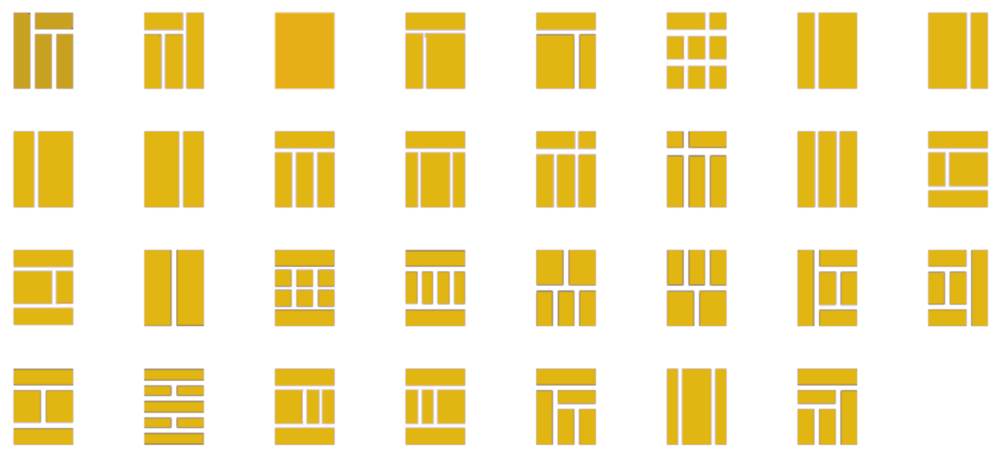

# Урок 4. Практика \(HTML теги\)

### Мета:

* навчитися писати валідну розмітку сайту, розгортати новий проект та готувати матеріали для проекту
* розвивати навички конструкторського мислення
* виховувати любов до чистого лаконічного коду

### І. Організація навчального процесу

Перевірка якості зв'язку та присутності студентів на занятті. Пропонуємо всім запустити редактор коду.

### ІІ. АОЗ

1. Як можна розрізняти бокові колонки, якщо їх декілька на одній сторінці?
2. На прикладі коду, що на екрані, назвіть батьківські, дочірні та сестринські елементи.
3. Коли саме варто використовувати коментарі?
4. Поясніть поняття кросбраузерності.

### ІІІ. Повідомлення теми та мети заняття

На сьогоднішньому занятті ми на практиці закріпимо раніше отримані знання. Ми навчимося писати HTML розмітку для нового проекту.

### IV. Практична робота

#### Layout веб-сторінки. Розбираємо макет майбутнього сайту

Існує багато версій макетів сайту. І їх розмаїття закінчується там, куди сягає ваша фантазія, або фантазія дизайнера!

Пропонуємо учням написати розмітку декількох секцій простого дизайн макету дотримуючись семантичної верстки.


Посилання на [макет](https://www.figma.com/file/dQy7rns2iU86AOWdUx5b6W/Untitled?node-id=0%3A1)


#### План роботи

1. Аналізуємо дизайн
2. Розгортаємо новий проект в редакторі
3. Експортуємо зображення із дизайну до проекту
4. Пишемо HTML розмітку сайту \(за виключенням секції "Меню"\)
5. Перевіряємо валідність коду

### V. Висновки

1. Перш ніж почати розробку нового проекту, його потрібно розгорнути в редакторі коду.
2. Файли проекту зазвичай зберігаються у папці однойменній із назвою проекту. В той же час файли стилів, зображення, шрифти, скрипти та ін розташовуються по окремих каталогах папки проекту.
3. Окремі блоки розмітки зазвичай прийнято коментувати задля покращення читабельності коду.
4. Однотипні елементи часто створюються за допомогою маркованого списку.

### VI. Домашнє завдання

Написати розмітку згідно запропонованого макету: [http://fecore.net.ua/psd/homework-01.psd](http://fecore.net.ua/psd/homework-01.psd)

