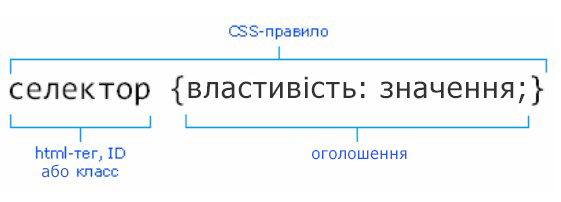

# Урок 5. Що таке CSS. Способи використання стилів. CSS-селектори.

### Мета

* познайомитись із каскадними таблицями стилів
* навчитись підключати їх до розмітки
* вивчити популярні CSS селектори
* розвивати навички застосування стилів для елементів розмітки
* виховувати любов до чистого та лаконічного коду.

### І. Організація навчального процесу

Перевіряємо явку та готовність учнів до роботи.

### ІІ. АОЗ

1. Які семантичні теги ви пам'ятаєте?
2. Розкажіть про атрибути. Як їх правильно додавати до тегів?
3. Пригадайте універсальні теги.

### III. Повідомлення теми, мети та завдань уроку

Сьогодні ми починаємо вивчення каскадних таблиць стилів. Ми маємо навчитись застосовувати стилі до розмітки та писати CSS-селектори.

### IV. Мотивація

Ми дізнаємося як можна стилізувати веб-сторінку та надати їй привабливого вигляду.

### V. Повідомлення нового матеріалу

#### **Що таке** CSS

**C**ascading **S**tyle **S**heets \(**CSS**\) — “каскадні таблиці стилів" - формальна мова опису зовнішнього вигляду веб-документу, написаного з використанням мови розмітки.

> CSS - візуальне оформлення веб-сайту. Актуальна версія мови на сьогодні - CSS3

#### Як можна підключити CSS до розмітки

Є три способи підключення стилів до HTML розмітки:

Інлайнові стилі - CSS-властивості вписуються безпосередньо в тег через атрибут `style`.


Вбудовані стилі - CSS-властивості записуються на початку html-документа в розділі `<head>` всередині тега `<style>`


Зовнішній файл стилів - всі CSS-властивості зібрані в окремому файлі, або файлах. Ці файли підключаються теж в розділі `<head>` за допомогою тега `<link>`.


#### Будова CSS-правила

**Оголошення стиля** складається з двох частин: елементу веб-сторінки - **селектора**, та команди форматування - **блоку оголошення**. Всередині блоку оголошення записуються властивості та їх значення через двокрапку.



#### CSS-селектори

<table>
  <thead>
    <tr>
      <th style="text-align:left">&#x421;&#x435;&#x43B;&#x435;&#x43A;&#x442;&#x43E;&#x440;</th>
      <th style="text-align:left">&#x421;&#x438;&#x43D;&#x442;&#x430;&#x43A;&#x441;&#x438;&#x441;</th>
    </tr>
  </thead>
  <tbody>
    <tr>
      <td style="text-align:left"><b>&#x423;&#x43D;&#x456;&#x432;&#x435;&#x440;&#x441;&#x430;&#x43B;&#x44C;&#x43D;&#x438;&#x439; </b>-
        &#x432;&#x456;&#x434;&#x43F;&#x43E;&#x432;&#x456;&#x434;&#x430;&#x454;
        &#x432;&#x441;&#x456;&#x43C; &#x435;&#x43B;&#x435;&#x43C;&#x435;&#x43D;&#x442;&#x430;&#x43C;
        &#x440;&#x43E;&#x437;&#x43C;&#x456;&#x442;&#x43A;&#x438;</td>
      <td style="text-align:left"> <code>* {...}</code>
      </td>
    </tr>
    <tr>
      <td style="text-align:left"><b>&#x422;&#x435;&#x433;&#x43E;&#x432;&#x44B;&#x439; &#x441;&#x435;&#x43B;&#x435;&#x43A;&#x442;&#x43E;&#x440; (&#x441;&#x435;&#x43B;&#x435;&#x43A;&#x442;&#x43E;&#x440; &#x44D;&#x43B;&#x435;&#x43C;&#x435;&#x43D;&#x442;&#x443;)</b> -
        &#x432;&#x456;&#x434;&#x43F;&#x43E;&#x432;&#x456;&#x434;&#x430;&#x454;
        &#x43D;&#x430;&#x437;&#x432;&#x456; html-&#x435;&#x43B;&#x435;&#x43C;&#x435;&#x43D;&#x442;&#x443;.
        &#x41D;&#x430;&#x43F;&#x440;&#x438;&#x43A;&#x43B;&#x430;&#x434;, &#x437;&#x432;&#x435;&#x440;&#x43D;&#x435;&#x43D;&#x43D;&#x44F;
        &#x434;&#x43E; &#x43F;&#x43E;&#x441;&#x438;&#x43B;&#x430;&#x43D;&#x43D;&#x44F;
        (&#x442;&#x435;&#x433; <code>&lt;a&gt;</code>)</td>
      <td style="text-align:left"><code>a {...}</code>
      </td>
    </tr>
    <tr>
      <td style="text-align:left"><b>&#x421;&#x435;&#x43B;&#x435;&#x43A;&#x442;&#x43E;&#x440; &#x43A;&#x43B;&#x430;&#x441;&#x443;</b> -
        &#x437;&#x432;&#x435;&#x440;&#x43D;&#x435;&#x43D;&#x43D;&#x44F; &#x434;&#x43E;
        &#x435;&#x43B;&#x435;&#x43C;&#x435;&#x43D;&#x442;&#x430; &#x447;&#x435;&#x440;&#x435;&#x437;
        &#x439;&#x43E;&#x433;&#x43E; &#x43A;&#x43B;&#x430;&#x441;</td>
      <td style="text-align:left">.box {...}</td>
    </tr>
    <tr>
      <td style="text-align:left"><b>&#x421;&#x435;&#x43B;&#x435;&#x43A;&#x442;&#x43E;&#x440; &#x456;&#x434;&#x435;&#x43D;&#x442;&#x438;&#x444;&#x456;&#x43A;&#x430;&#x442;&#x43E;&#x440;&#x430;</b> -
        &#x437;&#x432;&#x435;&#x440;&#x43D;&#x435;&#x43D;&#x43D;&#x44F; &#x434;&#x43E;
        &#x435;&#x43B;&#x435;&#x43C;&#x435;&#x43D;&#x442;&#x430; &#x447;&#x435;&#x440;&#x435;&#x437;
        &#x439;&#x43E;&#x433;&#x43E; &#x456;&#x434;&#x435;&#x43D;&#x442;&#x438;&#x444;&#x456;&#x43A;&#x430;&#x442;&#x43E;&#x440;</td>
      <td
      style="text-align:left">#top {...}</td>
    </tr>
    <tr>
      <td style="text-align:left"><b>&#x421;&#x435;&#x43B;&#x435;&#x43A;&#x442;&#x43E;&#x440; &#x433;&#x440;&#x443;&#x43F;</b> -
        &#x434;&#x43E;&#x437;&#x432;&#x43E;&#x43B;&#x44F;&#x454; &#x434;&#x430;&#x442;&#x438;
        &#x441;&#x442;&#x438;&#x43B;&#x456; &#x434;&#x435;&#x43A;&#x456;&#x43B;&#x44C;&#x43A;&#x43E;&#x43C;
        &#x435;&#x43B;&#x435;&#x43C;&#x435;&#x43D;&#x442;&#x430;&#x43C; &#x43E;&#x434;&#x43D;&#x43E;&#x447;&#x430;&#x441;&#x43D;&#x43E;</td>
      <td
      style="text-align:left">
        <p>h1,</p>
        <p>h2,</p>
        <p>h3 {...}</p>
        </td>
    </tr>
    <tr>
      <td style="text-align:left"><b>&#x421;&#x435;&#x43B;&#x435;&#x43A;&#x442;&#x43E;&#x440; &#x43D;&#x430;&#x449;&#x430;&#x434;&#x43A;&#x443;</b> -
        &#x434;&#x43E;&#x437;&#x432;&#x43E;&#x43B;&#x44F;&#x454; &#x437;&#x430;&#x434;&#x430;&#x442;&#x438;
        &#x441;&#x442;&#x438;&#x43B;&#x456; &#x434;&#x43E;&#x447;&#x456;&#x440;&#x43D;&#x456;&#x43C;
        &#x435;&#x43B;&#x435;&#x43C;&#x435;&#x43D;&#x442;&#x430;&#x43C;</td>
      <td
      style="text-align:left">body a {...}</td>
    </tr>
    <tr>
      <td style="text-align:left"><b>&#x414;&#x43E;&#x447;&#x456;&#x440;&#x43D;&#x438;&#x439; &#x441;&#x435;&#x43B;&#x435;&#x43A;&#x442;&#x43E;&#x440;</b> -
        &#x434;&#x43E;&#x437;&#x432;&#x43E;&#x43B;&#x44F;&#x454; &#x437;&#x430;&#x434;&#x430;&#x442;&#x438;
        &#x441;&#x442;&#x438;&#x43B;&#x456; &#x434;&#x43E;&#x447;&#x456;&#x440;&#x43D;&#x456;&#x43C;
        &#x435;&#x43B;&#x435;&#x43C;&#x435;&#x43D;&#x442;&#x430;&#x43C;, &#x44F;&#x43A;&#x456;
        &#x439;&#x434;&#x443;&#x442;&#x44C; &#x43E;&#x434;&#x440;&#x430;&#x437;&#x443;
        &#x43F;&#x456;&#x441;&#x43B;&#x44F; &#x431;&#x430;&#x442;&#x44C;&#x43A;&#x456;&#x432;&#x441;&#x44C;&#x43A;&#x43E;&#x433;&#x43E;
        &#x442;&#x435;&#x433;&#x430;</td>
      <td style="text-align:left">header &gt; div {...}</td>
    </tr>
    <tr>
      <td style="text-align:left"><b>&#x421;&#x443;&#x441;&#x456;&#x434;&#x43D;&#x456;&#x439; &#x441;&#x435;&#x43B;&#x435;&#x43A;&#x442;&#x43E;&#x440;</b> -
        &#x434;&#x430;&#x454; &#x437;&#x43C;&#x43E;&#x433;&#x443; &#x437;&#x432;&#x435;&#x440;&#x43D;&#x443;&#x442;&#x438;&#x441;&#x44C;
        &#x434;&#x43E; &#x441;&#x443;&#x441;&#x456;&#x434;&#x43D;&#x44C;&#x43E;&#x433;&#x43E;
        &#x435;&#x43B;&#x435;&#x43C;&#x435;&#x43D;&#x442;&#x430;, &#x44F;&#x43A;&#x438;&#x439;
        &#x454; &#x431;&#x435;&#x437;&#x43F;&#x43E;&#x441;&#x435;&#x440;&#x435;&#x434;&#x43D;&#x44C;&#x43E;
        &#x43D;&#x430;&#x441;&#x442;&#x443;&#x43F;&#x43D;&#x438;&#x43C; &#x43F;&#x456;&#x441;&#x43B;&#x44F;
        &#x432;&#x43A;&#x430;&#x437;&#x430;&#x43D;&#x43E;&#x433;&#x43E; &#x435;&#x43B;&#x435;&#x43C;&#x435;&#x43D;&#x442;&#x430;
        &#x456; &#x44F;&#x43A;&#x449;&#x43E; &#x443; &#x43D;&#x438;&#x445; &#x43E;&#x434;&#x438;&#x43D;
        &#x431;&#x430;&#x442;&#x44C;&#x43A;&#x456;&#x432;&#x441;&#x44C;&#x43A;&#x438;&#x439;
        &#x435;&#x43B;&#x435;&#x43C;&#x435;&#x43D;&#x442;</td>
      <td style="text-align:left">header + main {...}</td>
    </tr>
    <tr>
      <td style="text-align:left"><b>&#x421;&#x43F;&#x43E;&#x440;&#x456;&#x434;&#x43D;&#x435;&#x43D;&#x438;&#x439; &#x441;&#x435;&#x43B;&#x435;&#x43A;&#x442;&#x43E;&#x440;</b> -
        &#x43F;&#x440;&#x430;&#x446;&#x44E;&#x454; &#x442;&#x430;&#x43A; &#x441;&#x430;&#x43C;&#x43E;,
        &#x44F;&#x43A; &#x456; &#x441;&#x443;&#x441;&#x456;&#x434;&#x43D;&#x456;&#x439;,
        &#x442;&#x456;&#x43B;&#x44C;&#x43A;&#x438; &#x432;&#x438;&#x431;&#x438;&#x440;&#x430;&#x454;
        &#x432;&#x441;&#x456; &#x43D;&#x430;&#x441;&#x442;&#x443;&#x43F;&#x43D;&#x456;
        &#x435;&#x43B;&#x435;&#x43C;&#x435;&#x43D;&#x442;&#x456; &#x43F;&#x456;&#x441;&#x43B;&#x44F;
        &#x432;&#x43A;&#x430;&#x437;&#x430;&#x43D;&#x43E;&#x433;&#x43E;, &#x44F;&#x43A;&#x456;
        &#x454; &#x434;&#x43E;&#x447;&#x456;&#x440;&#x43D;&#x456;&#x43C;&#x438;
        &#x43E;&#x434;&#x43D;&#x43E;&#x433;&#x43E; &#x431;&#x430;&#x442;&#x44C;&#x43A;&#x456;&#x432;&#x441;&#x44C;&#x43A;&#x43E;&#x433;&#x43E;
        &#x442;&#x435;&#x433;&#x430;.</td>
      <td style="text-align:left">main ~ article {...}</td>
    </tr>
    <tr>
      <td style="text-align:left"><b>&#x421;&#x435;&#x43B;&#x435;&#x43A;&#x442;&#x43E;&#x440; &#x430;&#x442;&#x440;&#x438;&#x431;&#x443;&#x442;&#x443;</b> -
        &#x437;&#x432;&#x435;&#x440;&#x43D;&#x435;&#x43D;&#x43D;&#x44F; &#x434;&#x43E;
        &#x435;&#x43B;&#x435;&#x43C;&#x435;&#x43D;&#x442;&#x430; &#x447;&#x435;&#x440;&#x435;&#x437;
        &#x439;&#x43E;&#x433;&#x43E; &#x430;&#x442;&#x440;&#x438;&#x431;&#x443;&#x442;</td>
      <td
      style="text-align:left">input[type=text] {...}</td>
    </tr>
  </tbody>
</table>

Роботу всіх селекторів варто показати на реальному прикладі, записуючи код в редакторі з демонстрацією екрана.

### VI. Узагальнення та систематизація знань

1. Яка будова CSS-правила
2. Як можна підключити CSS-стилі до розмітки?
3. Які селектори вам найбільше запам'ятались?

### VII. Домашнє завдання

У вас є вихідний html-код, який не можна редагувати:

```text
<div class="holder">
  <h1>Title</h1>
  <ul class="list">
    <li>
      <a href="#">link1</a>
      <ul>
        <li><a href="#">link2</a></li>
        <li><a href="#">link3</a></li>
      </ul>
    </li>
    <li><a href="https://www.youtube.com/">link4</a></li>
    <li><a href="https://validator.w3.org/">link5</a></li>
    <li><a href="#">link6</a></li>
  </ul>
  <p>Lorem ipsum, dolor sit amet consectetur adipisicing elit. Dolore, accusamus.</p>
  <h1>Title</h1>
  <p>Lorem ipsum dolor sit amet.</p>
</div>
```

Напишіть CSS-селектор, за допомогою яких:

* зверніться тільки до тих посилань, значення атрибутів href яких починається з https та зробіть їх червоного кольору
* буде діяти тільки для &lt;p&gt;, який іде після &lt;ul&gt; і зробіть розмір його шрифта 24рх.

